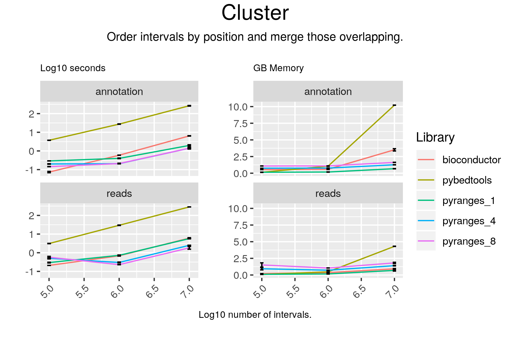

# Cluster

## Code

#### pyranges

result = gr.cluster(strand="same")

#### bioconductor

result = reduce(gr)

#### pybedtools

# using merge because cluster does not work;
#  output has same number of lines

if extension == "gtf":
    cols_to_keep = [4, 5, 7]
elif extension == "bed":
    cols_to_keep = [4, 5, 6]

plus = pb1.sort().merge(S="+", c=cols_to_keep, o="first")
plus.head()
minus = pb1.sort().merge(S="-", c=cols_to_keep, o="first")
minus.head()
result = plus.cat(minus, s=True, c=[4, 5, 6], o="first")

## Results

#### pyranges

+--------------+-----------+-----------+----------+
| Chromosome   | Start     | End       | Strand   |
| (int8)       | (int32)   | (int32)   | (int8)   |
|--------------+-----------+-----------+----------|
| chr1         | 65418     | 65433     | +        |
| chr1         | 587628    | 594768    | +        |
| chr1         | 631073    | 632616    | +        |
| ...          | ...       | ...       | ...      |
| chrY         | 26277922  | 26354418  | -        |
| chrY         | 57171889  | 57172769  | -        |
| chrY         | 57212183  | 57213125  | -        |
+--------------+-----------+-----------+----------+
PyRanges object has 60323 sequences from 25 chromosomes.

#### bioconductor

GRanges object with 60323 ranges and 0 metadata columns:
          seqnames        ranges strand
             <Rle>     <IRanges>  <Rle>
      [1]     chr1   65419-65433      +
      [2]     chr1 587629-594768      +
      [3]     chr1 631074-632616      +
      [4]     chr1 778782-782191      +
      [5]     chr1 784370-805127      +
      ...      ...           ...    ...
  [60319]     chrM     4263-4331      +
  [60320]     chrM   10405-10469      +
  [60321]     chrM   15888-15953      +
  [60322]     chrM     4329-4400      -
  [60323]     chrM     7446-7514      -
  -------
  seqinfo: 25 sequences from an unspecified genome; no seqlengths

#### pybedtools

chr1	17368	17436	17369	17436	-
chr1	65418	65433	65419	65433	+
chr1	89550	91105	89551	91105	-
chr1	188790	188902	188791	188902	-
chr1	297344	297502	297345	297502	-
chr1	373181	485208	373182	485208	-
chr1	494474	495368	494475	495368	-
chr1	498280	499175	498281	499175	-
chr1	504979	505103	504980	505103	-
chr1	522858	522928	522859	522928	-
Number of lines: 60323

