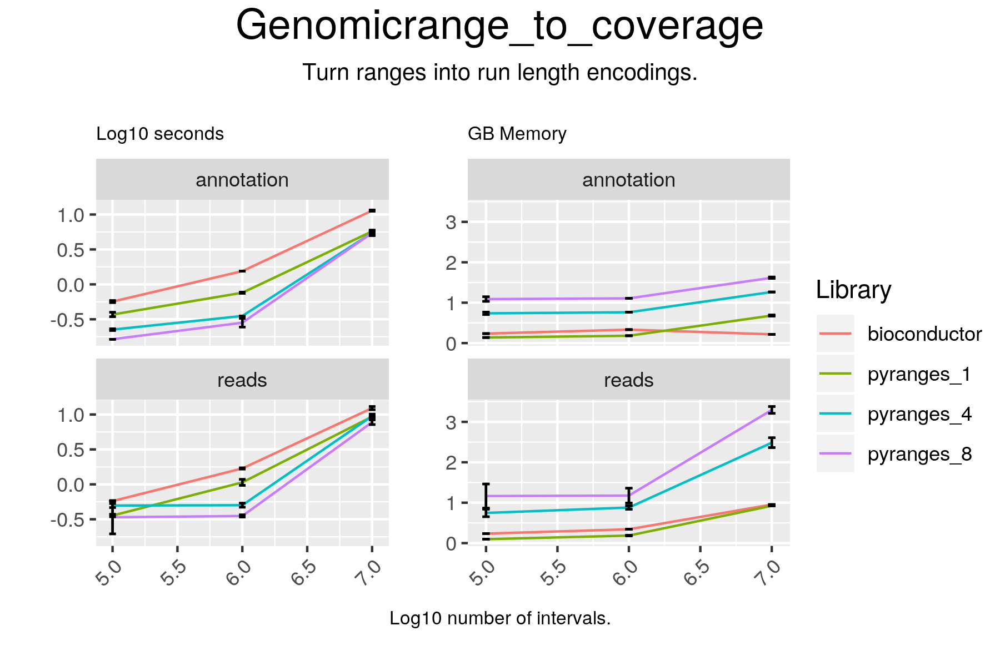

# Genomicrange_to_coverage

## Code

#### pyranges

result = gr.coverage(strand="same")

#### bioconductor

plus = coverage(gr[gr@strand == "+"])
minus = coverage(gr[gr@strand == "-"])
result = c(plus, minus)

## Results

#### pyranges

chr1 +
+--------+---------+------+----------+--------+---------+---------+--------+-----+---------+---------+--------+
| Runs   | 65418   | 15   | 522195   | 7140   | 36305   |  ...    | 1612   | 3   | 58918   | 12165   | 1586   |
|--------+---------+------+----------+--------+---------+---------+--------+-----+---------+---------+--------|
| Values | 0.0     | 1.0  | 0.0      | 1.0    | 0.0     | ...     | 0.0    | 1.0 | 0.0     | 1.0     | 3.0    |
+--------+---------+------+----------+--------+---------+---------+--------+-----+---------+---------+--------+
Rle of length 248919946 containing 8089 elements
...
chrY -
+--------+----------+--------+--------+------+----------+---------+---------+------------+-------+---------+-------+
| Runs   | 334238   | 4472   | 7463   | 87   | 662242   |  ...    | 15424   | 30817471   | 880   | 39414   | 942   |
|--------+----------+--------+--------+------+----------+---------+---------+------------+-------+---------+-------|
| Values | 0.0      | 1.0    | 0.0    | 1.0  | 0.0      | ...     | 1.0     | 0.0        | 1.0   | 0.0     | 1.0   |
+--------+----------+--------+--------+------+----------+---------+---------+------------+-------+---------+-------+
Rle of length 57213125 containing 246 elements
PyRles object with 50 chromosomes/strand pairs.

#### bioconductor

RleList of length 50
$chr1
integer-Rle of length 248919946 with 8089 runs
  Lengths:  65418     15 522195   7140  36305 ...      3  58918  12165   1586
  Values :      0      1      0      1      0 ...      1      0      1      3

$chr10
integer-Rle of length 133778699 with 2994 runs
  Lengths:  179993      19   29876     160 ...  210827    1267   27029     454
  Values :       0       1       0       2 ...       0       1       0       1

$chr11
integer-Rle of length 134373808 with 5075 runs
  Lengths:  197296       8    2639      87 ...   14953     141    2572      88
  Values :       0       1       0       1 ...       0       1       0       1

$chr12
integer-Rle of length 133205173 with 4625 runs
  Lengths:  99145     69  75384   3862 210887 ...  14071     16    155   2859
  Values :      0      1      0      1      0 ...      0      1      3      2

$chr13
integer-Rle of length 114323845 with 1388 runs
  Lengths: 18219525       25   112382    16664 ...       96     9199        3
  Values :        0        1        0        1 ...        1        0        1

...
<45 more elements>

