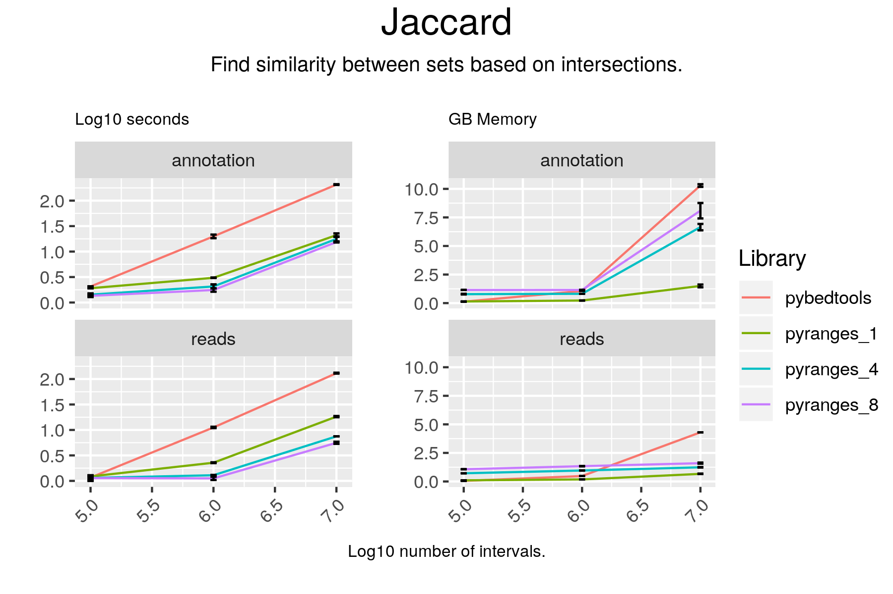

# Jaccard

## Code

#### pyranges

result = gr2.jaccard(gr)

#### pybedtools

result = pb2.sort().jaccard(pb1.sort())

## Results

#### pyranges

0.001554615537606122

#### pybedtools

{'intersection': 978933, 'union-intersection': 308302908, 'jaccard': 0.00317523, 'n_intersections': 9952}Number of lines: 0

