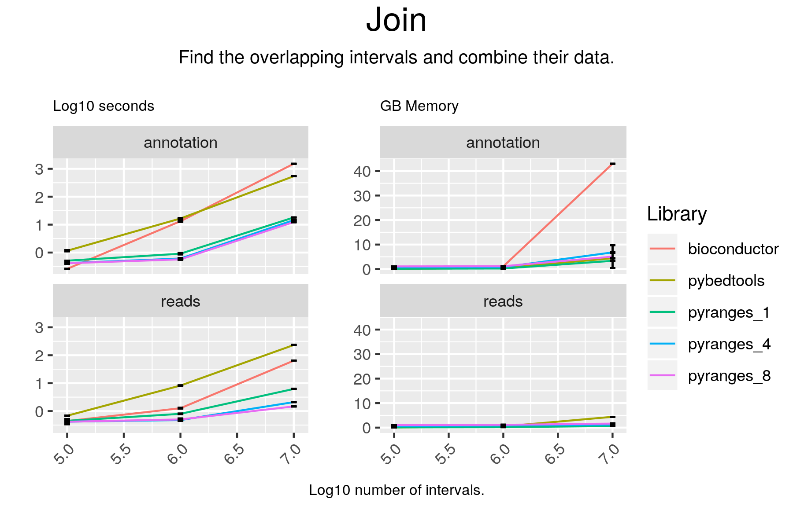

# Join



## Code

#### pyranges

```
result = gr2.join(gr, strandedness="same")

```

#### pybedtools

```
result = pb2.intersect(pb1, wao=True, s=True)
```

#### bioconductor

```
result <- findOverlapPairs(gr1, gr2, ignore.strand = FALSE)
df1 = as.data.frame(first(result))
df2 = as.data.frame(second(result))
colnames(df2) = paste0(colnames(df2), "_b")
df = merge(df1, df2, by=0)
result = makeGRangesFromDataFrame(df, keep.extra.columns=TRUE)

```

## Results

#### pyranges

```
+--------------+-----------+-----------+----------+------------+-------------+----------------+--------------+-------------+-----------+-----------+------------+
| Chromosome   | Start     | End       | Strand   | Feature    | GeneID      | TranscriptID   | ExonNumber   | ExonID      | Start_b   | End_b     | Strand_b   |
| (int8)       | (int32)   | (int32)   | (int8)   | (object)   | (float64)   | (float64)      | (int16)      | (float64)   | (int32)   | (int32)   | (int8)     |
|--------------+-----------+-----------+----------+------------+-------------+----------------+--------------+-------------+-----------+-----------+------------|
| chr1         | 111140225 | 111185102 | +        | transcript | 134255.0    | 357172.0       | -1           | nan         | 111170246 | 111170346 | +          |
| chr1         | 151070577 | 151125542 | +        | gene       | 143458.0    | nan            | -1           | nan         | 151115705 | 151115805 | +          |
| chr1         | 8026737   | 8122702   | +        | gene       | 238290.0    | nan            | -1           | nan         | 8058305   | 8058405   | +          |
| ...          | ...       | ...       | ...      | ...        | ...         | ...            | ...          | ...         | ...       | ...       | ...        |
| chrY         | 26277922  | 26354418  | -        | gene       | 229238.0    | nan            | -1           | nan         | 26281389  | 26281489  | -          |
| chrY         | 26277922  | 26354418  | -        | gene       | 229238.0    | nan            | -1           | nan         | 26281610  | 26281710  | -          |
| chrY         | 26277922  | 26354418  | -        | gene       | 229238.0    | nan            | -1           | nan         | 26350175  | 26350275  | -          |
+--------------+-----------+-----------+----------+------------+-------------+----------------+--------------+-------------+-----------+-----------+------------+
PyRanges object has 5972 sequences from 24 chromosomes.
```

#### pybedtools

```
chr2	ENSEMBL	CDS	110641034	110641205	.	-	1	gene_id "ENSG00000169679.14"; transcript_id "ENST00000535254.5"; gene_type "protein_coding"; gene_name "BUB1"; transcript_type "protein_coding"; transcript_name "BUB1-212"; exon_number 22; exon_id "ENSE00001146562.1"; level 3; protein_id "ENSP00000441013.1"; transcript_support_level "2"; tag "basic"; tag "appris_alternative_2"; tag "CCDS"; ccdsid "CCDS62984.1"; havana_gene "OTTHUMG00000153638.5";	.	-1	-1	.	-1	.	0
chr17	HAVANA	exon	8319007	8319159	.	+	.	gene_id "ENSG00000198844.11"; transcript_id "ENST00000361926.7"; gene_type "protein_coding"; gene_name "ARHGEF15"; transcript_type "protein_coding"; transcript_name "ARHGEF15-201"; exon_number 13; exon_id "ENSE00000855086.1"; level 2; protein_id "ENSP00000355026.3"; transcript_support_level "1"; tag "basic"; tag "appris_principal_1"; tag "CCDS"; ccdsid "CCDS11139.1"; havana_gene "OTTHUMG00000108187.6"; havana_transcript "OTTHUMT00000226993.3";	.	-1	-1	.	-1	.	0
chr22	HAVANA	exon	43995391	43995490	.	+	.	gene_id "ENSG00000100347.14"; transcript_id "ENST00000493621.1"; gene_type "protein_coding"; gene_name "SAMM50"; transcript_type "processed_transcript"; transcript_name "SAMM50-205"; exon_number 1; exon_id "ENSE00001829394.1"; level 2; transcript_support_level "2"; havana_gene "OTTHUMG00000150557.4"; havana_transcript "OTTHUMT00000318983.1";	.	-1	-1	.	-1	.	0
chr1	HAVANA	exon	160299102	160299264	.	-	.	gene_id "ENSG00000122218.15"; transcript_id "ENST00000648501.1"; gene_type "protein_coding"; gene_name "COPA"; transcript_type "nonsense_mediated_decay"; transcript_name "COPA-213"; exon_number 12; exon_id "ENSE00003836016.1"; level 2; protein_id "ENSP00000498118.1"; tag "mRNA_start_NF"; tag "cds_start_NF"; tag "RNA_Seq_supported_only"; havana_gene "OTTHUMG00000033111.8"; havana_transcript "OTTHUMT00000498717.1";	.	-1	-1	.	-1	.	0
chr17	HAVANA	exon	10679050	10681253	.	-	.	gene_id "ENSG00000133028.11"; transcript_id "ENST00000577335.2"; gene_type "protein_coding"; gene_name "SCO1"; transcript_type "nonsense_mediated_decay"; transcript_name "SCO1-202"; exon_number 7; exon_id "ENSE00003831584.1"; level 2; protein_id "ENSP00000464032.1"; transcript_support_level "3"; tag "NAGNAG_splice_site"; havana_gene "OTTHUMG00000130364.8"; havana_transcript "OTTHUMT00000440329.2";	.	-1	-1	.	-1	.	0
chr11	ENSEMBL	CDS	123622506	123622592	.	+	0	gene_id "ENSG00000023171.17"; transcript_id "ENST00000322282.11"; gene_type "protein_coding"; gene_name "GRAMD1B"; transcript_type "protein_coding"; transcript_name "GRAMD1B-201"; exon_number 20; exon_id "ENSE00001465572.4"; level 3; protein_id "ENSP00000325628.7"; transcript_support_level "5"; tag "basic"; havana_gene "OTTHUMG00000166004.6";	.	-1	-1	.	-1	.	0
chr7	HAVANA	UTR	711506	711527	.	-	.	gene_id "ENSG00000188191.14"; transcript_id "ENST00000360274.8"; gene_type "protein_coding"; gene_name "PRKAR1B"; transcript_type "protein_coding"; transcript_name "PRKAR1B-201"; exon_number 2; exon_id "ENSE00003653279.1"; level 2; protein_id "ENSP00000353415.4"; transcript_support_level "1"; tag "basic"; tag "appris_principal_1"; tag "CCDS"; ccdsid "CCDS34579.1"; havana_gene "OTTHUMG00000151411.5"; havana_transcript "OTTHUMT00000322523.1";	.	-1	-1	.	-1	.	0
chr7	HAVANA	exon	100156386	100156549	.	-	.	gene_id "ENSG00000146826.16"; transcript_id "ENST00000456769.5"; gene_type "protein_coding"; gene_name "C7orf43"; transcript_type "protein_coding"; transcript_name "C7orf43-206"; exon_number 8; exon_id "ENSE00000977581.2"; level 2; protein_id "ENSP00000389672.2"; transcript_support_level "2"; tag "basic"; tag "CCDS"; ccdsid "CCDS78261.1"; havana_gene "OTTHUMG00000154862.6"; havana_transcript "OTTHUMT00000337425.4";	.	-1	-1	.	-1	.	0
chr3	HAVANA	exon	108213931	108214021	.	-	.	gene_id "ENSG00000114446.4"; transcript_id "ENST00000478157.1"; gene_type "protein_coding"; gene_name "IFT57"; transcript_type "nonsense_mediated_decay"; transcript_name "IFT57-204"; exon_number 3; exon_id "ENSE00003532129.1"; level 2; protein_id "ENSP00000417768.1"; transcript_support_level "5"; havana_gene "OTTHUMG00000159223.2"; havana_transcript "OTTHUMT00000353919.1";	.	-1	-1	.	-1	.	0
chr17	HAVANA	exon	47051296	47051400	.	+	.	gene_id "ENSG00000263142.5"; transcript_id "ENST00000570311.1"; gene_type "transcribed_unprocessed_pseudogene"; gene_name "LRRC37A17P"; transcript_type "transcribed_unprocessed_pseudogene"; transcript_name "LRRC37A17P-201"; exon_number 8; exon_id "ENSE00002636545.1"; level 2; transcript_support_level "NA"; ont "PGO:0000005"; ont "PGO:0000019"; tag "basic"; havana_gene "OTTHUMG00000178082.1"; havana_transcript "OTTHUMT00000440449.1";	.	-1	-1	.	-1	.	0
Number of lines: 103088

```

#### bioconductor

```
GRanges object with 5973 ranges and 26 metadata columns:
         seqnames              ranges strand |   Row.names seqnames_b   start_b
            <Rle>           <IRanges>  <Rle> | <character>   <factor> <integer>
     [1]     chr3   69249506-69249606      - |           1       chr3  69169990
     [2]    chr22   43001897-43001997      - |          10      chr22  42890935
     [3]    chr12     2249730-2249830      + |         100      chr12   2053563
     [4]    chr21   40211613-40211713      - |        1000      chr21  40010999
     [5]     chr8   73541291-73541391      - |        1001       chr8  73420371
     ...      ...                 ...    ... .         ...        ...       ...
  [5969]    chr17   28135023-28135123      + |         995      chr17  28043030
  [5970]     chr1 148172425-148172525      - |         996       chr1 148159213
  [5971]     chr1 240353345-240353445      + |         997       chr1 240329144
  [5972]     chr8 130388804-130388904      - |         998       chr8 130052842
  [5973]     chr5 134116979-134117079      + |         999       chr5 134115659
             end_b   width_b strand_b source_b     type_b   score_b   phase_b
         <integer> <integer> <factor> <factor>   <factor> <numeric> <integer>
     [1]  69542583    372594        -   HAVANA       gene      <NA>      <NA>
     [2]  43015135    124201        -   HAVANA transcript      <NA>      <NA>
     [3]   2691293    637731        +   HAVANA transcript      <NA>      <NA>
     [4]  40847139    836141        -   HAVANA       gene      <NA>      <NA>
     [5]  73746937    326567        -   HAVANA transcript      <NA>      <NA>
     ...       ...       ...      ...      ...        ...       ...       ...
  [5969]  28196381    153352        +   HAVANA transcript      <NA>      <NA>
  [5970] 148255012     95800        -   HAVANA       gene      <NA>      <NA>
  [5971] 240475183    146040        +  ENSEMBL transcript      <NA>      <NA>
  [5972] 130401968    349127        -   HAVANA transcript      <NA>      <NA>
  [5973] 134142265     26607        +   HAVANA transcript      <NA>      <NA>
                  gene_id_b   transcript_id_b    gene_type_b gene_name_b
                <character>       <character>    <character> <character>
     [1] ENSG00000114541.14              <NA> protein_coding      FRMD4B
     [2] ENSG00000100266.18 ENST00000453643.5 protein_coding     PACSIN2
     [3] ENSG00000151067.21 ENST00000399595.5 protein_coding     CACNA1C
     [4] ENSG00000171587.14              <NA> protein_coding       DSCAM
     [5] ENSG00000040341.17 ENST00000524300.5 protein_coding       STAU2
     ...                ...               ...            ...         ...
  [5969] ENSG00000087095.12 ENST00000496808.1 protein_coding         NLK
  [5970]  ENSG00000227733.9              <NA>        lincRNA  AC239809.3
  [5971] ENSG00000155816.19 ENST00000545751.2 protein_coding        FMN2
  [5972] ENSG00000153317.14 ENST00000521075.5 protein_coding       ASAP1
  [5973] ENSG00000081059.19 ENST00000517741.5 protein_coding        TCF7
               transcript_type_b transcript_name_b exon_number_b   exon_id_b
                     <character>       <character>   <character> <character>
     [1]                    <NA>              <NA>          <NA>        <NA>
     [2]          protein_coding       PACSIN2-210          <NA>        <NA>
     [3]          protein_coding       CACNA1C-206          <NA>        <NA>
     [4]                    <NA>              <NA>          <NA>        <NA>
     [5]          protein_coding         STAU2-229          <NA>        <NA>
     ...                     ...               ...           ...         ...
  [5969] nonsense_mediated_decay           NLK-202          <NA>        <NA>
  [5970]                    <NA>              <NA>          <NA>        <NA>
  [5971]          protein_coding          FMN2-207          <NA>        <NA>
  [5972] nonsense_mediated_decay         ASAP1-211          <NA>        <NA>
  [5973] nonsense_mediated_decay          TCF7-206          <NA>        <NA>
             level_b      protein_id_b transcript_support_level_b
         <character>       <character>                <character>
     [1]           2              <NA>                       <NA>
     [2]           2 ENSP00000398573.1                          5
     [3]           2 ENSP00000382504.1                          1
     [4]           1              <NA>                       <NA>
     [5]           2 ENSP00000428756.1                          2
     ...         ...               ...                        ...
  [5969]           2 ENSP00000433117.1                          2
  [5970]           2              <NA>                       <NA>
  [5971]           3 ENSP00000437918.2                          5
  [5972]           2 ENSP00000428463.1                          1
  [5973]           2 ENSP00000427758.1                          5
                     tag_b    ccdsid_b         havana_gene_b
               <character> <character>           <character>
     [1] overlapping_locus        <NA>  OTTHUMG00000158772.4
     [2]        cds_end_NF        <NA>  OTTHUMG00000150701.7
     [3]              CCDS CCDS44795.1 OTTHUMG00000150243.11
     [4] overlapping_locus        <NA>  OTTHUMG00000086732.1
     [5]              CCDS CCDS55247.1 OTTHUMG00000164499.10
     ...               ...         ...                   ...
  [5969]      cds_start_NF        <NA>  OTTHUMG00000132451.8
  [5970]              <NA>        <NA> OTTHUMG00000013881.11
  [5971]             basic        <NA>  OTTHUMG00000039883.5
  [5972]              <NA>        <NA>  OTTHUMG00000164772.3
  [5973]              <NA>        <NA>  OTTHUMG00000129124.4
          havana_transcript_b       ont_b
                  <character> <character>
     [1]                 <NA>        <NA>
     [2] OTTHUMT00000319671.2        <NA>
     [3] OTTHUMT00000317020.1        <NA>
     [4]                 <NA>        <NA>
     [5] OTTHUMT00000379000.2        <NA>
     ...                  ...         ...
  [5969] OTTHUMT00000255608.3        <NA>
  [5970]                 <NA>        <NA>
  [5971]                 <NA>        <NA>
  [5972] OTTHUMT00000380169.1        <NA>
  [5973] OTTHUMT00000379981.1        <NA>
  -------
  seqinfo: 24 sequences from an unspecified genome; no seqlengths

```

