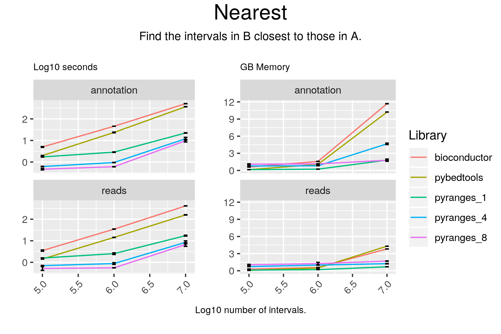

# Nearest

## Code

#### pyranges

result = gr.nearest(gr2, strandedness="same")

#### bioconductor

result = distanceToNearest(gr2, gr1, ignore.strand = FALSE, select="arbitrary")
subject = as.data.frame(gr1[subjectHits(result)])
colnames(subject) = paste0(colnames(subject), "_b")
query = as.data.frame(gr2[queryHits(result)])
df = merge(subject, query, by=0)
df = df[, -1]
df = merge(df, mcols(result)$distance, by=0)
df = df[, -1]
result = makeGRangesFromDataFrame(df, keep.extra.columns=TRUE)

#### pybedtools

result = pb2.sort().closest(pb1.sort(), s=True, t="first", d=True)

## Results

#### pyranges

+--------------+-----------+-----------+----------+-----------+-----------+------------+------------+-------------+----------------+--------------+-------------+------------+
| Chromosome   | Start     | End       | Strand   | Start_b   | End_b     | Strand_b   | Feature    | GeneID      | TranscriptID   | ExonNumber   | ExonID      | Distance   |
| (int8)       | (int32)   | (int32)   | (int8)   | (int32)   | (int32)   | (int8)     | (object)   | (float64)   | (float64)      | (int16)      | (float64)   | (int64)    |
|--------------+-----------+-----------+----------+-----------+-----------+------------+------------+-------------+----------------+--------------+-------------+------------|
| chr1         | 22917977  | 22918077  | +        | 22913867  | 22921500  | +          | UTR        | 133216.0    | 400191.0       | 17           | 3711038.0   | 0          |
| chr1         | 28844433  | 28844533  | +        | 28812141  | 28863283  | +          | transcript | 116329.0    | 621425.0       | -1           | nan         | 0          |
| chr1         | 84196383  | 84196483  | +        | 84164381  | 84238494  | +          | transcript | 142875.0    | 394838.0       | -1           | nan         | 0          |
| ...          | ...       | ...       | ...      | ...       | ...       | ...        | ...        | ...         | ...            | ...          | ...         | ...        |
| chrY         | 56983950  | 56984050  | -        | 57171889  | 57172769  | -          | exon       | 223484.0    | 421233.0       | 1            | 1611457.0   | 187840     |
| chrY         | 57151108  | 57151208  | -        | 57171889  | 57172769  | -          | exon       | 223484.0    | 421233.0       | 1            | 1611457.0   | 20682      |
| chrY         | 57185390  | 57185490  | -        | 57171889  | 57172769  | -          | exon       | 223484.0    | 421233.0       | 1            | 1611457.0   | 12622      |
+--------------+-----------+-----------+----------+-----------+-----------+------------+------------+-------------+----------------+--------------+-------------+------------+
PyRanges object has 100000 sequences from 24 chromosomes.

#### bioconductor

GRanges object with 99994 ranges and 26 metadata columns:
          seqnames              ranges strand | seqnames_b   start_b     end_b
             <Rle>           <IRanges>  <Rle> |   <factor> <integer> <integer>
      [1]     chr2 110641034-110641205      - |       chr2 110548454 110548554
      [2]     chr9   95086021-95086088      + |       chr9  95057818  95057918
      [3]     chr1 120005329-120005588      - |       chr1 120025566 120025666
      [4]     chrX   63785146-63785524      - |       chrX  63814846  63814946
      [5]    chr17   31182508-31182896      + |      chr17  31164834  31164934
      ...      ...                 ...    ... .        ...       ...       ...
  [99990]     chr3 186570163-186570897      + |       chr3 186613435 186613535
  [99991]    chr12   41572364-41573887      + |      chr12  41633238  41633338
  [99992]     chr1   11972872-11972997      + |       chr1  11978982  11979082
  [99993]    chr10   18256579-18257320      - |      chr10  18283305  18283405
  [99994]    chr14   39147812-39170322      - |      chr14  39132711  39132811
            width_b strand_b   source       type     score     phase
          <integer> <factor> <factor>   <factor> <numeric> <integer>
      [1]       101        -  ENSEMBL        CDS      <NA>         1
      [2]       101        +  ENSEMBL transcript      <NA>      <NA>
      [3]       101        -   HAVANA        CDS      <NA>         1
      [4]       101        -   HAVANA        UTR      <NA>      <NA>
      [5]       101        +   HAVANA        CDS      <NA>         2
      ...       ...      ...      ...        ...       ...       ...
  [99990]       101        +   HAVANA        UTR      <NA>      <NA>
  [99991]       101        +   HAVANA        CDS      <NA>         0
  [99992]       101        +   HAVANA        CDS      <NA>         0
  [99993]       101        -   HAVANA       exon      <NA>      <NA>
  [99994]       101        -   HAVANA transcript      <NA>      <NA>
                     gene_id     transcript_id            gene_type   gene_name
                 <character>       <character>          <character> <character>
      [1] ENSG00000169679.14 ENST00000535254.5       protein_coding        BUB1
      [2]  ENSG00000284459.1 ENST00000637495.1                miRNA     MIR24-1
      [3] ENSG00000134250.19 ENST00000256646.6       protein_coding      NOTCH2
      [4] ENSG00000131089.15 ENST00000437457.6       protein_coding     ARHGEF9
      [5] ENSG00000196712.17 ENST00000490416.2       protein_coding         NF1
      ...                ...               ...                  ...         ...
  [99990] ENSG00000090520.11 ENST00000439351.5       protein_coding     DNAJB11
  [99991] ENSG00000165966.15 ENST00000649474.1       protein_coding      PDZRN4
  [99992] ENSG00000083444.16 ENST00000196061.4       protein_coding       PLOD1
  [99993]  ENSG00000235020.4 ENST00000627265.1 processed_transcript  AL390783.1
  [99994] ENSG00000182400.14 ENST00000330149.9       protein_coding    TRAPPC6B
          transcript_type transcript_name exon_number           exon_id
              <character>     <character> <character>       <character>
      [1]  protein_coding        BUB1-212          22 ENSE00001146562.1
      [2]           miRNA     MIR24-1-201        <NA>              <NA>
      [3]  protein_coding      NOTCH2-201           3 ENSE00003735657.1
      [4]  protein_coding     ARHGEF9-205           1 ENSE00001464989.2
      [5]  protein_coding         NF1-214           5 ENSE00001931842.2
      ...             ...             ...         ...               ...
  [99990]  protein_coding     DNAJB11-202           2 ENSE00001719045.1
  [99991]  protein_coding      PDZRN4-205           9 ENSE00003838551.1
  [99992]  protein_coding       PLOD1-201          18 ENSE00001664074.1
  [99993]       antisense  AL390783.1-204           2 ENSE00003761590.1
  [99994]  protein_coding    TRAPPC6B-201        <NA>              <NA>
                level        protein_id transcript_support_level
          <character>       <character>              <character>
      [1]           3 ENSP00000441013.1                        2
      [2]           3              <NA>                       NA
      [3]           2 ENSP00000256646.2                        1
      [4]           2 ENSP00000399994.3                        5
      [5]           2 ENSP00000491431.1                        3
      ...         ...               ...                      ...
  [99990]           2 ENSP00000414398.1                        1
  [99991]           2 ENSP00000497437.1                     <NA>
  [99992]           2 ENSP00000196061.4                        1
  [99993]           2              <NA>                        5
  [99994]           2 ENSP00000330289.5                        1
                            tag      ccdsid           havana_gene
                    <character> <character>           <character>
      [1]                  CCDS CCDS62984.1  OTTHUMG00000153638.5
      [2]                 basic        <NA>                  <NA>
      [3]                  CCDS   CCDS908.1  OTTHUMG00000012177.5
      [4]                 basic        <NA> OTTHUMG00000021700.11
      [5]                 basic        <NA>  OTTHUMG00000132871.9
      ...                   ...         ...                   ...
  [99990]                  CCDS  CCDS3277.1  OTTHUMG00000156614.2
  [99991]                 basic        <NA>  OTTHUMG00000169364.3
  [99992]                  CCDS   CCDS142.1  OTTHUMG00000002393.4
  [99993] 454_RNA_Seq_supported        <NA>  OTTHUMG00000017760.3
  [99994]                  CCDS CCDS41947.1  OTTHUMG00000140259.4
             havana_transcript         ont         y
                   <character> <character> <integer>
      [1]                 <NA>        <NA>     92479
      [2]                 <NA>        <NA>      6723
      [3] OTTHUMT00000033679.1        <NA>      7688
      [4] OTTHUMT00000479398.1        <NA>      5632
      [5] OTTHUMT00000259464.2        <NA>     55125
      ...                  ...         ...       ...
  [99990] OTTHUMT00000344779.1        <NA>     42537
  [99991] OTTHUMT00000499253.2        <NA>     59350
  [99992] OTTHUMT00000006865.1        <NA>      5984
  [99993] OTTHUMT00000480557.1        <NA>     25984
  [99994] OTTHUMT00000276775.1        <NA>     15000
  -------
  seqinfo: 25 sequences from an unspecified genome; no seqlengths

#### pybedtools

chr1	ENSEMBL	gene	17369	17436	.	-	.	gene_id "ENSG00000278267.1"; gene_type "miRNA"; gene_name "MIR6859-1"; level 3;	chr1	48326	48426	10243	100	-	30891
chr1	HAVANA	exon	65419	65433	.	+	.	gene_id "ENSG00000186092.6"; transcript_id "ENST00000641515.2"; gene_type "protein_coding"; gene_name "OR4F5"; transcript_type "protein_coding"; transcript_name "OR4F5-202"; exon_number 1; exon_id "ENSE00003812156.1"; level 2; protein_id "ENSP00000493376.2"; tag "RNA_Seq_supported_partial"; tag "basic"; havana_gene "OTTHUMG00000001094.4"; havana_transcript "OTTHUMT00000003223.4";	chr1	84130	84230	95640	100	+	18698
chr1	HAVANA	transcript	89551	91105	.	-	.	gene_id "ENSG00000239945.1"; transcript_id "ENST00000495576.1"; gene_type "lincRNA"; gene_name "AL627309.3"; transcript_type "lincRNA"; transcript_name "AL627309.3-201"; level 2; transcript_support_level "5"; tag "basic"; havana_gene "OTTHUMG00000001097.2"; havana_transcript "OTTHUMT00000003226.2";	chr1	99516	99616	60846	100	-	8412
chr1	HAVANA	exon	188791	188902	.	-	.	gene_id "ENSG00000279457.4"; transcript_id "ENST00000623083.4"; gene_type "unprocessed_pseudogene"; gene_name "FO538757.1"; transcript_type "unprocessed_pseudogene"; transcript_name "FO538757.1-201"; exon_number 2; exon_id "ENSE00003755850.1"; level 2; transcript_support_level "NA"; ont "PGO:0000005"; tag "basic"; havana_gene "OTTHUMG00000191963.1"; havana_transcript "OTTHUMT00000491421.1";	chr1	176201	176301	31227	100	-	12490
chr1	HAVANA	exon	297345	297502	.	-	.	gene_id "ENSG00000228463.10"; transcript_id "ENST00000424587.7"; gene_type "transcribed_processed_pseudogene"; gene_name "AP006222.1"; transcript_type "processed_transcript"; transcript_name "AP006222.1-206"; exon_number 1; exon_id "ENSE00001697423.1"; level 2; transcript_support_level "5"; havana_gene "OTTHUMG00000002552.3"; havana_transcript "OTTHUMT00000007242.3";	chr1	283250	283350	3899	100	-	13995
chr1	HAVANA	transcript	373182	485208	.	-	.	gene_id "ENSG00000237094.12"; transcript_id "ENST00000455207.5"; gene_type "transcribed_unprocessed_pseudogene"; gene_name "AL732372.2"; transcript_type "processed_transcript"; transcript_name "AL732372.2-204"; level 2; transcript_support_level "5"; tag "not_best_in_genome_evidence"; havana_gene "OTTHUMG00000002857.7"; havana_transcript "OTTHUMT00000007991.1";	chr1	377483	377583	57003	100	-	0
chr1	HAVANA	CDS	450743	451678	.	-	0	gene_id "ENSG00000284733.1"; transcript_id "ENST00000426406.3"; gene_type "protein_coding"; gene_name "OR4F29"; transcript_type "protein_coding"; transcript_name "OR4F29-201"; exon_number 1; exon_id "ENSE00002316283.3"; level 2; protein_id "ENSP00000409316.1"; transcript_support_level "NA"; tag "basic"; tag "appris_principal_1"; tag "CCDS"; ccdsid "CCDS72675.1"; havana_gene "OTTHUMG00000002860.3"; havana_transcript "OTTHUMT00000007999.3";	chr1	473313	473413	35241	100	-	21636
chr1	HAVANA	transcript	494475	495368	.	-	.	gene_id "ENSG00000237094.12"; transcript_id "ENST00000642074.1"; gene_type "transcribed_unprocessed_pseudogene"; gene_name "AL732372.2"; transcript_type "processed_transcript"; transcript_name "AL732372.2-211"; level 2; havana_gene "OTTHUMG00000002857.7"; havana_transcript "OTTHUMT00000493597.1";	chr1	514639	514739	24849	100	-	19272
chr1	HAVANA	transcript	498281	499175	.	-	.	gene_id "ENSG00000237094.12"; transcript_id "ENST00000432964.1"; gene_type "transcribed_unprocessed_pseudogene"; gene_name "AL732372.2"; transcript_type "processed_transcript"; transcript_name "AL732372.2-220"; level 2; transcript_support_level "3"; havana_gene "OTTHUMG00000002857.7"; havana_transcript "OTTHUMT00000346878.1";	chr1	514639	514739	24849	100	-	15465
chr1	HAVANA	exon	504980	505103	.	-	.	gene_id "ENSG00000237094.12"; transcript_id "ENST00000641303.1"; gene_type "transcribed_unprocessed_pseudogene"; gene_name "AL732372.2"; transcript_type "processed_transcript"; transcript_name "AL732372.2-222"; exon_number 3; exon_id "ENSE00003812904.1"; level 2; havana_gene "OTTHUMG00000002857.7"; havana_transcript "OTTHUMT00000493601.1";	chr1	514639	514739	24849	100	-	9537
Number of lines: 100000

