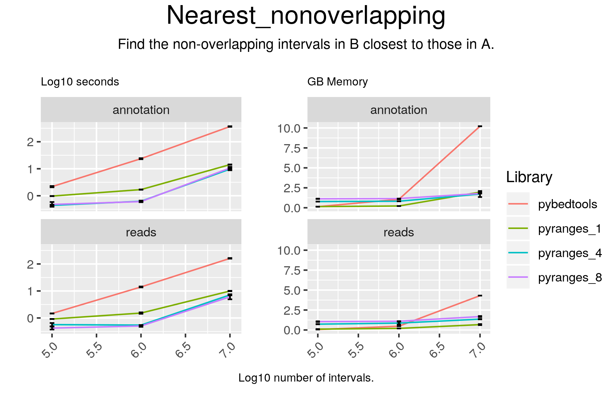

# Nearest_nonoverlapping

## Code

#### pyranges

result = gr.nearest(gr2, strandedness="same", overlap=False)

#### pybedtools

result = pb2.sort().closest(pb1.sort(), s=True, t="first", io=True, d=True)

## Results

#### pyranges

+--------------+-----------+-----------+----------+-----------+-----------+------------+------------+-------------+----------------+--------------+-------------+------------+
| Chromosome   | Start     | End       | Strand   | Start_b   | End_b     | Strand_b   | Feature    | GeneID      | TranscriptID   | ExonNumber   | ExonID      | Distance   |
| (int8)       | (int32)   | (int32)   | (int8)   | (int32)   | (int32)   | (int8)     | (object)   | (float64)   | (float64)      | (int16)      | (float64)   | (int64)    |
|--------------+-----------+-----------+----------+-----------+-----------+------------+------------+-------------+----------------+--------------+-------------+------------|
| chr1         | 84130     | 84230     | +        | 65418     | 65433     | +          | exon       | 186092.0    | 641515.0       | 1            | 3812156.0   | 18698      |
| chr1         | 170940    | 171040    | +        | 65418     | 65433     | +          | exon       | 186092.0    | 641515.0       | 1            | 3812156.0   | 105508     |
| chr1         | 194583    | 194683    | +        | 65418     | 65433     | +          | exon       | 186092.0    | 641515.0       | 1            | 3812156.0   | 129151     |
| ...          | ...       | ...       | ...      | ...       | ...       | ...        | ...        | ...         | ...            | ...          | ...         | ...        |
| chrY         | 56983950  | 56984050  | -        | 57171889  | 57172769  | -          | exon       | 223484.0    | 421233.0       | 1            | 1611457.0   | 187840     |
| chrY         | 57151108  | 57151208  | -        | 57171889  | 57172769  | -          | exon       | 223484.0    | 421233.0       | 1            | 1611457.0   | 20682      |
| chrY         | 57185390  | 57185490  | -        | 57171889  | 57172769  | -          | exon       | 223484.0    | 421233.0       | 1            | 1611457.0   | 12622      |
+--------------+-----------+-----------+----------+-----------+-----------+------------+------------+-------------+----------------+--------------+-------------+------------+
PyRanges object has 100000 sequences from 24 chromosomes.

#### pybedtools

chr1	ENSEMBL	gene	17369	17436	.	-	.	gene_id "ENSG00000278267.1"; gene_type "miRNA"; gene_name "MIR6859-1"; level 3;	chr1	48326	48426	10243	100	-	30891
chr1	HAVANA	exon	65419	65433	.	+	.	gene_id "ENSG00000186092.6"; transcript_id "ENST00000641515.2"; gene_type "protein_coding"; gene_name "OR4F5"; transcript_type "protein_coding"; transcript_name "OR4F5-202"; exon_number 1; exon_id "ENSE00003812156.1"; level 2; protein_id "ENSP00000493376.2"; tag "RNA_Seq_supported_partial"; tag "basic"; havana_gene "OTTHUMG00000001094.4"; havana_transcript "OTTHUMT00000003223.4";	chr1	84130	84230	95640	100	+	18698
chr1	HAVANA	transcript	89551	91105	.	-	.	gene_id "ENSG00000239945.1"; transcript_id "ENST00000495576.1"; gene_type "lincRNA"; gene_name "AL627309.3"; transcript_type "lincRNA"; transcript_name "AL627309.3-201"; level 2; transcript_support_level "5"; tag "basic"; havana_gene "OTTHUMG00000001097.2"; havana_transcript "OTTHUMT00000003226.2";	chr1	99516	99616	60846	100	-	8412
chr1	HAVANA	exon	188791	188902	.	-	.	gene_id "ENSG00000279457.4"; transcript_id "ENST00000623083.4"; gene_type "unprocessed_pseudogene"; gene_name "FO538757.1"; transcript_type "unprocessed_pseudogene"; transcript_name "FO538757.1-201"; exon_number 2; exon_id "ENSE00003755850.1"; level 2; transcript_support_level "NA"; ont "PGO:0000005"; tag "basic"; havana_gene "OTTHUMG00000191963.1"; havana_transcript "OTTHUMT00000491421.1";	chr1	176201	176301	31227	100	-	12490
chr1	HAVANA	exon	297345	297502	.	-	.	gene_id "ENSG00000228463.10"; transcript_id "ENST00000424587.7"; gene_type "transcribed_processed_pseudogene"; gene_name "AP006222.1"; transcript_type "processed_transcript"; transcript_name "AP006222.1-206"; exon_number 1; exon_id "ENSE00001697423.1"; level 2; transcript_support_level "5"; havana_gene "OTTHUMG00000002552.3"; havana_transcript "OTTHUMT00000007242.3";	chr1	283250	283350	3899	100	-	13995
chr1	HAVANA	transcript	373182	485208	.	-	.	gene_id "ENSG00000237094.12"; transcript_id "ENST00000455207.5"; gene_type "transcribed_unprocessed_pseudogene"; gene_name "AL732372.2"; transcript_type "processed_transcript"; transcript_name "AL732372.2-204"; level 2; transcript_support_level "5"; tag "not_best_in_genome_evidence"; havana_gene "OTTHUMG00000002857.7"; havana_transcript "OTTHUMT00000007991.1";	chr1	514639	514739	24849	100	-	29432
chr1	HAVANA	CDS	450743	451678	.	-	0	gene_id "ENSG00000284733.1"; transcript_id "ENST00000426406.3"; gene_type "protein_coding"; gene_name "OR4F29"; transcript_type "protein_coding"; transcript_name "OR4F29-201"; exon_number 1; exon_id "ENSE00002316283.3"; level 2; protein_id "ENSP00000409316.1"; transcript_support_level "NA"; tag "basic"; tag "appris_principal_1"; tag "CCDS"; ccdsid "CCDS72675.1"; havana_gene "OTTHUMG00000002860.3"; havana_transcript "OTTHUMT00000007999.3";	chr1	473313	473413	35241	100	-	21636
chr1	HAVANA	transcript	494475	495368	.	-	.	gene_id "ENSG00000237094.12"; transcript_id "ENST00000642074.1"; gene_type "transcribed_unprocessed_pseudogene"; gene_name "AL732372.2"; transcript_type "processed_transcript"; transcript_name "AL732372.2-211"; level 2; havana_gene "OTTHUMG00000002857.7"; havana_transcript "OTTHUMT00000493597.1";	chr1	514639	514739	24849	100	-	19272
chr1	HAVANA	transcript	498281	499175	.	-	.	gene_id "ENSG00000237094.12"; transcript_id "ENST00000432964.1"; gene_type "transcribed_unprocessed_pseudogene"; gene_name "AL732372.2"; transcript_type "processed_transcript"; transcript_name "AL732372.2-220"; level 2; transcript_support_level "3"; havana_gene "OTTHUMG00000002857.7"; havana_transcript "OTTHUMT00000346878.1";	chr1	514639	514739	24849	100	-	15465
chr1	HAVANA	exon	504980	505103	.	-	.	gene_id "ENSG00000237094.12"; transcript_id "ENST00000641303.1"; gene_type "transcribed_unprocessed_pseudogene"; gene_name "AL732372.2"; transcript_type "processed_transcript"; transcript_name "AL732372.2-222"; exon_number 3; exon_id "ENSE00003812904.1"; level 2; havana_gene "OTTHUMG00000002857.7"; havana_transcript "OTTHUMT00000493601.1";	chr1	514639	514739	24849	100	-	9537
Number of lines: 100000

