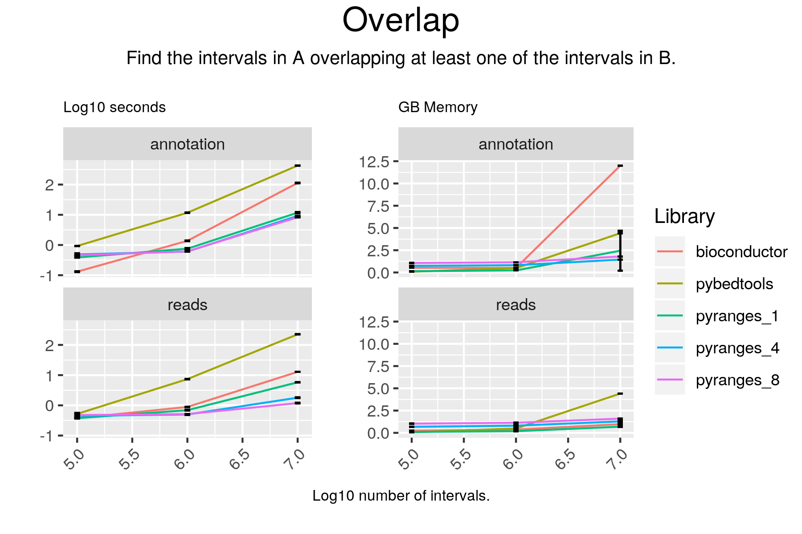

# Overlap

## Code

#### pyranges

result = gr2.overlap(gr, strandedness="same")

#### bioconductor

result = findOverlapPairs(gr2, gr1, ignore.strand = FALSE)
result = first(result)

#### pybedtools

result = pb2.intersect(pb1, s=True, wa=True)

## Results

#### pyranges

+--------------+-----------+-----------+----------+------------+-------------+----------------+--------------+-------------+
| Chromosome   | Start     | End       | Strand   | Feature    | GeneID      | TranscriptID   | ExonNumber   | ExonID      |
| (int8)       | (int32)   | (int32)   | (int8)   | (object)   | (float64)   | (float64)      | (int16)      | (float64)   |
|--------------+-----------+-----------+----------+------------+-------------+----------------+--------------+-------------|
| chr1         | 111140225 | 111185102 | +        | transcript | 134255.0    | 357172.0       | -1           | nan         |
| chr1         | 151070577 | 151125542 | +        | gene       | 143458.0    | nan            | -1           | nan         |
| chr1         | 8026737   | 8122702   | +        | gene       | 238290.0    | nan            | -1           | nan         |
| ...          | ...       | ...       | ...      | ...        | ...         | ...            | ...          | ...         |
| chrY         | 26277922  | 26354418  | -        | gene       | 229238.0    | nan            | -1           | nan         |
| chrY         | 26277922  | 26354418  | -        | gene       | 229238.0    | nan            | -1           | nan         |
| chrY         | 26277922  | 26354418  | -        | gene       | 229238.0    | nan            | -1           | nan         |
+--------------+-----------+-----------+----------+------------+-------------+----------------+--------------+-------------+
PyRanges object has 5972 sequences from 24 chromosomes.

#### bioconductor

GRanges object with 5973 ranges and 20 metadata columns:
         seqnames              ranges strand |   source       type     score
            <Rle>           <IRanges>  <Rle> | <factor>   <factor> <numeric>
     [1]    chr19   16574907-16578777      - |   HAVANA transcript      <NA>
     [2]    chr16   57186333-57239957      + |   HAVANA transcript      <NA>
     [3]    chr11 119421611-119422562      - |   HAVANA       exon      <NA>
     [4]     chr2 144424916-144424918      - |   HAVANA stop_codon      <NA>
     [5]    chr20     1392962-1393162      - |   HAVANA       exon      <NA>
     ...      ...                 ...    ... .      ...        ...       ...
  [5969]    chr19   41397808-41422207      + |   HAVANA transcript      <NA>
  [5970]    chr19   41397808-41422207      + |   HAVANA transcript      <NA>
  [5971]     chr9   36136536-36163913      + |   HAVANA       gene      <NA>
  [5972]    chr20   47298729-47298872      - |   HAVANA       exon      <NA>
  [5973]    chr14   19062360-19107110      + |   HAVANA transcript      <NA>
             phase            gene_id     transcript_id
         <integer>        <character>       <character>
     [1]      <NA> ENSG00000105085.10 ENST00000597244.1
     [2]      <NA> ENSG00000159579.13 ENST00000537866.5
     [3]      <NA> ENSG00000154096.13 ENST00000528522.5
     [4]         0 ENSG00000169554.19 ENST00000636732.2
     [5]      <NA> ENSG00000088832.16 ENST00000400137.8
     ...       ...                ...               ...
  [5969]      <NA> ENSG00000248098.11 ENST00000538423.5
  [5970]      <NA> ENSG00000248098.11 ENST00000538423.5
  [5971]      <NA> ENSG00000122694.15              <NA>
  [5972]      <NA> ENSG00000101040.19 ENST00000360911.7
  [5973]      <NA> ENSG00000225210.10 ENST00000610585.4
                                gene_type   gene_name         transcript_type
                              <character> <character>             <character>
     [1]                   protein_coding       MED26         retained_intron
     [2]                   protein_coding      RSPRY1          protein_coding
     [3]                   protein_coding        THY1          protein_coding
     [4]                   protein_coding        ZEB2 nonsense_mediated_decay
     [5]                   protein_coding      FKBP1A          protein_coding
     ...                              ...         ...                     ...
  [5969]                   protein_coding      BCKDHA         retained_intron
  [5970]                   protein_coding      BCKDHA         retained_intron
  [5971]                   protein_coding      GLIPR2                    <NA>
  [5972]                   protein_coding      ZMYND8          protein_coding
  [5973] transcribed_processed_pseudogene      DUXAP9    processed_transcript
         transcript_name exon_number           exon_id       level
             <character> <character>       <character> <character>
     [1]       MED26-202        <NA>              <NA>           2
     [2]      RSPRY1-202        <NA>              <NA>           2
     [3]        THY1-206           1 ENSE00002196788.1           2
     [4]        ZEB2-237           4 ENSE00003795206.1           2
     [5]      FKBP1A-204           1 ENSE00001561754.3           2
     ...             ...         ...               ...         ...
  [5969]      BCKDHA-204        <NA>              <NA>           2
  [5970]      BCKDHA-204        <NA>              <NA>           2
  [5971]            <NA>        <NA>              <NA>           2
  [5972]      ZMYND8-205           4 ENSE00003621371.1           2
  [5973]      DUXAP9-203        <NA>              <NA>           2
                protein_id transcript_support_level                    tag
               <character>              <character>            <character>
     [1]              <NA>                       NA                   <NA>
     [2] ENSP00000443176.1                        2                   CCDS
     [3] ENSP00000431301.1                        2                   CCDS
     [4] ENSP00000490175.1                        5 RNA_Seq_supported_only
     [5] ENSP00000383003.4                        1                   CCDS
     ...               ...                      ...                    ...
  [5969]              <NA>                        5                   <NA>
  [5970]              <NA>                        5                   <NA>
  [5971]              <NA>                     <NA>                   <NA>
  [5972] ENSP00000354166.3                        1                   CCDS
  [5973]              <NA>                        3                   <NA>
              ccdsid           havana_gene    havana_transcript         ont
         <character>           <character>          <character> <character>
     [1]        <NA>  OTTHUMG00000182433.4 OTTHUMT00000461177.1        <NA>
     [2] CCDS10775.1  OTTHUMG00000133462.6 OTTHUMT00000432953.1        <NA>
     [3]  CCDS8424.1  OTTHUMG00000166202.4 OTTHUMT00000388372.1        <NA>
     [4]        <NA>  OTTHUMG00000187624.9 OTTHUMT00000490514.2        <NA>
     [5] CCDS13014.1  OTTHUMG00000031666.3 OTTHUMT00000077534.2        <NA>
     ...         ...                   ...                  ...         ...
  [5969]        <NA>  OTTHUMG00000168128.4 OTTHUMT00000398331.1        <NA>
  [5970]        <NA>  OTTHUMG00000168128.4 OTTHUMT00000398331.1        <NA>
  [5971]        <NA>  OTTHUMG00000019900.2                 <NA>        <NA>
  [5972] CCDS46613.1 OTTHUMG00000032667.11 OTTHUMT00000079590.3        <NA>
  [5973]        <NA>  OTTHUMG00000188246.4 OTTHUMT00000477540.1        <NA>
  -------
  seqinfo: 25 sequences from an unspecified genome; no seqlengths

#### pybedtools

chr19	HAVANA	transcript	16574907	16578777	.	-	.	gene_id "ENSG00000105085.10"; transcript_id "ENST00000597244.1"; gene_type "protein_coding"; gene_name "MED26"; transcript_type "retained_intron"; transcript_name "MED26-202"; level 2; transcript_support_level "NA"; havana_gene "OTTHUMG00000182433.4"; havana_transcript "OTTHUMT00000461177.1";
chr16	HAVANA	transcript	57186333	57239957	.	+	.	gene_id "ENSG00000159579.13"; transcript_id "ENST00000537866.5"; gene_type "protein_coding"; gene_name "RSPRY1"; transcript_type "protein_coding"; transcript_name "RSPRY1-202"; level 2; protein_id "ENSP00000443176.1"; transcript_support_level "2"; tag "alternative_5_UTR"; tag "basic"; tag "appris_principal_1"; tag "CCDS"; ccdsid "CCDS10775.1"; havana_gene "OTTHUMG00000133462.6"; havana_transcript "OTTHUMT00000432953.1";
chr11	HAVANA	exon	119421611	119422562	.	-	.	gene_id "ENSG00000154096.13"; transcript_id "ENST00000528522.5"; gene_type "protein_coding"; gene_name "THY1"; transcript_type "protein_coding"; transcript_name "THY1-206"; exon_number 1; exon_id "ENSE00002196788.1"; level 2; protein_id "ENSP00000431301.1"; transcript_support_level "2"; tag "alternative_5_UTR"; tag "basic"; tag "appris_principal_1"; tag "CCDS"; ccdsid "CCDS8424.1"; havana_gene "OTTHUMG00000166202.4"; havana_transcript "OTTHUMT00000388372.1";
chr2	HAVANA	stop_codon	144424916	144424918	.	-	0	gene_id "ENSG00000169554.19"; transcript_id "ENST00000636732.2"; gene_type "protein_coding"; gene_name "ZEB2"; transcript_type "nonsense_mediated_decay"; transcript_name "ZEB2-237"; exon_number 4; exon_id "ENSE00003795206.1"; level 2; protein_id "ENSP00000490175.1"; transcript_support_level "5"; tag "RNA_Seq_supported_only"; havana_gene "OTTHUMG00000187624.9"; havana_transcript "OTTHUMT00000490514.2";
chr20	HAVANA	exon	1392962	1393162	.	-	.	gene_id "ENSG00000088832.16"; transcript_id "ENST00000400137.8"; gene_type "protein_coding"; gene_name "FKBP1A"; transcript_type "protein_coding"; transcript_name "FKBP1A-204"; exon_number 1; exon_id "ENSE00001561754.3"; level 2; protein_id "ENSP00000383003.4"; transcript_support_level "1"; tag "alternative_3_UTR"; tag "basic"; tag "appris_principal_1"; tag "CCDS"; ccdsid "CCDS13014.1"; havana_gene "OTTHUMG00000031666.3"; havana_transcript "OTTHUMT00000077534.2";
chr5	HAVANA	transcript	75511891	75598167	.	+	.	gene_id "ENSG00000122008.15"; transcript_id "ENST00000510815.6"; gene_type "protein_coding"; gene_name "POLK"; transcript_type "nonsense_mediated_decay"; transcript_name "POLK-213"; level 2; protein_id "ENSP00000422094.2"; transcript_support_level "2"; havana_gene "OTTHUMG00000102107.6"; havana_transcript "OTTHUMT00000369138.2";
chr19	HAVANA	start_codon	33800455	33800457	.	+	0	gene_id "ENSG00000153885.14"; transcript_id "ENST00000588881.5"; gene_type "protein_coding"; gene_name "KCTD15"; transcript_type "protein_coding"; transcript_name "KCTD15-206"; exon_number 4; exon_id "ENSE00003683934.1"; level 2; protein_id "ENSP00000464812.1"; transcript_support_level "2"; tag "alternative_5_UTR"; tag "basic"; tag "appris_principal_1"; tag "CCDS"; ccdsid "CCDS46039.1"; havana_gene "OTTHUMG00000180475.5"; havana_transcript "OTTHUMT00000451460.1";
chr17	HAVANA	exon	4946628	4947469	.	-	.	gene_id "ENSG00000108518.7"; transcript_id "ENST00000574872.1"; gene_type "protein_coding"; gene_name "PFN1"; transcript_type "protein_coding"; transcript_name "PFN1-203"; exon_number 1; exon_id "ENSE00002681343.1"; level 2; protein_id "ENSP00000465019.1"; transcript_support_level "2"; tag "basic"; havana_gene "OTTHUMG00000099396.4"; havana_transcript "OTTHUMT00000438743.2";
chr1	HAVANA	transcript	156035301	156053794	.	-	.	gene_id "ENSG00000160803.7"; transcript_id "ENST00000368309.3"; gene_type "protein_coding"; gene_name "UBQLN4"; transcript_type "protein_coding"; transcript_name "UBQLN4-201"; level 2; protein_id "ENSP00000357292.3"; transcript_support_level "1"; tag "basic"; tag "appris_principal_1"; tag "CCDS"; ccdsid "CCDS1127.1"; havana_gene "OTTHUMG00000017461.2"; havana_transcript "OTTHUMT00000046193.1";
chr1	HAVANA	transcript	150810094	150876705	.	-	.	gene_id "ENSG00000143437.20"; transcript_id "ENST00000471844.6"; gene_type "protein_coding"; gene_name "ARNT"; transcript_type "nonsense_mediated_decay"; transcript_name "ARNT-204"; level 2; protein_id "ENSP00000425899.1"; transcript_support_level "2"; tag "non_canonical_TEC"; havana_gene "OTTHUMG00000035011.3"; havana_transcript "OTTHUMT00000360627.2";
Number of lines: 5972

