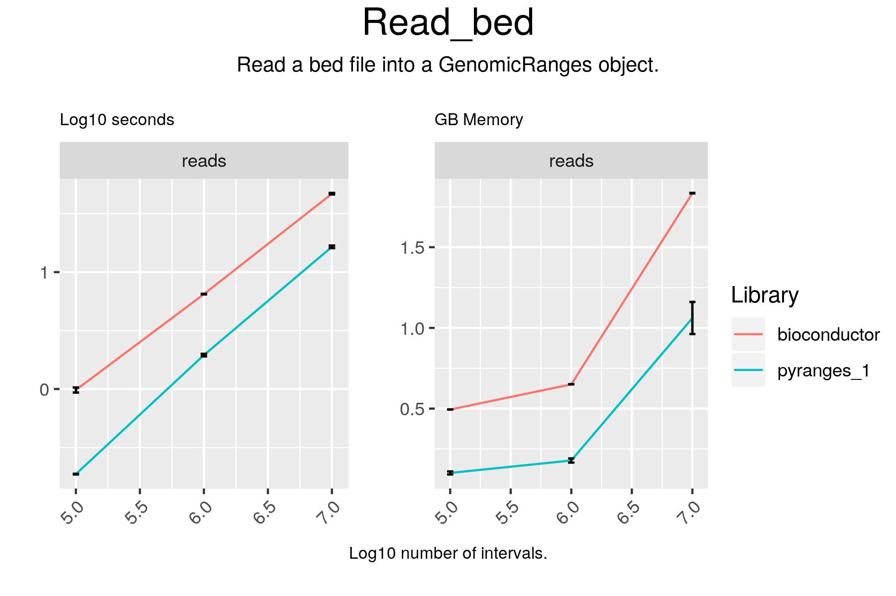

# Read_bed

## Code

#### pyranges

result = pr.read_bed(f)

#### bioconductor

result = import(file)

## Results

#### pyranges

+--------------+-----------+-----------+-----------+-----------+----------+
| Chromosome   | Start     | End       | Name      | Score     | Strand   |
| (int8)       | (int32)   | (int32)   | (int64)   | (int64)   | (int8)   |
|--------------+-----------+-----------+-----------+-----------+----------|
| chr1         | 39741600  | 39741700  | 16        | 100       | +        |
| chr1         | 174721961 | 174722061 | 23        | 100       | +        |
| chr1         | 86451671  | 86451771  | 39        | 100       | +        |
| ...          | ...       | ...       | ...       | ...       | ...      |
| chrY         | 26377940  | 26378040  | 99396     | 100       | -        |
| chrY         | 23015978  | 23016078  | 99744     | 100       | -        |
| chrY         | 42174782  | 42174882  | 99841     | 100       | -        |
+--------------+-----------+-----------+-----------+-----------+----------+
PyRanges object has 100000 sequences from 24 chromosomes.

#### bioconductor

GRanges object with 100000 ranges and 2 metadata columns:
           seqnames              ranges strand |        name     score
              <Rle>           <IRanges>  <Rle> | <character> <numeric>
       [1]    chr10 133497736-133497835      - |           1       100
       [2]    chr16   69494036-69494135      + |           2       100
       [3]     chr1 156678710-156678809      - |           3       100
       [4]     chr9   67965861-67965960      + |           4       100
       [5]     chr7   41403841-41403940      + |           5       100
       ...      ...                 ...    ... .         ...       ...
   [99996]    chr14   80373740-80373839      - |       99996       100
   [99997]     chr5   23483751-23483850      - |       99997       100
   [99998]    chr18   22702436-22702535      - |       99998       100
   [99999]     chr4 104065659-104065758      + |       99999       100
  [100000]     chrX   96817180-96817279      - |      100000       100
  -------
  seqinfo: 24 sequences from an unspecified genome; no seqlengths

