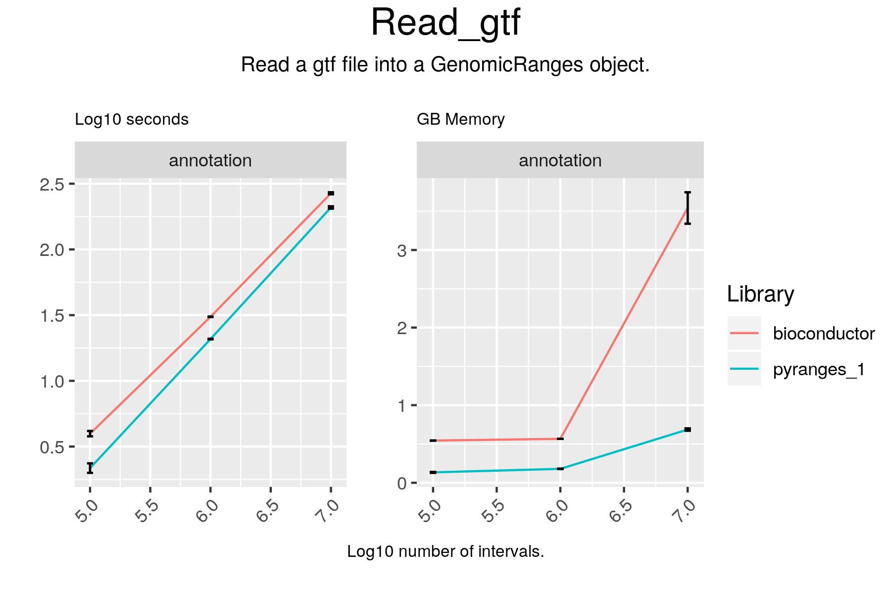

# Read_gtf



## Code

#### pyranges

```
result = pr.read_gtf(f, annotation="ensembl")

```

#### bioconductor

```
result = import(file)

```

## Results

#### pyranges

```
+--------------+-----------+-----------+----------+------------+-------------+----------------+--------------+-------------+
| Chromosome   | Start     | End       | Strand   | Feature    | GeneID      | TranscriptID   | ExonNumber   | ExonID      |
| (int8)       | (int32)   | (int32)   | (int8)   | (object)   | (float64)   | (float64)      | (int16)      | (float64)   |
|--------------+-----------+-----------+----------+------------+-------------+----------------+--------------+-------------|
| chr1         | 39479797  | 39480009  | +        | CDS        | 127603.0    | 361689.0       | 91           | 3546381.0   |
| chr1         | 84173328  | 84173352  | +        | CDS        | 142875.0    | 436133.0       | 2            | 1414414.0   |
| chr1         | 179293713 | 179293936 | +        | UTR        | 57252.0     | 540564.0       | 1            | 2262754.0   |
| ...          | ...       | ...       | ...      | ...        | ...         | ...            | ...          | ...         |
| chrY         | 26086086  | 26086199  | -        | exon       | 234888.0    | 411536.0       | 3            | 1614971.0   |
| chrY         | 23190573  | 23190637  | -        | exon       | 188120.0    | 540248.0       | 5            | 1677573.0   |
| chrY         | 7701186   | 7701247   | -        | exon       | 225520.0    | 437686.0       | 1            | 1723990.0   |
+--------------+-----------+-----------+----------+------------+-------------+----------------+--------------+-------------+
PyRanges object has 100000 sequences from 25 chromosomes.
```

#### bioconductor

```
GRanges object with 100000 ranges and 20 metadata columns:
           seqnames              ranges strand |   source       type     score
              <Rle>           <IRanges>  <Rle> | <factor>   <factor> <numeric>
       [1]     chr2 110641034-110641205      - |  ENSEMBL        CDS      <NA>
       [2]    chr17     8319007-8319159      + |   HAVANA       exon      <NA>
       [3]    chr22   43995391-43995490      + |   HAVANA       exon      <NA>
       [4]     chr1 160299102-160299264      - |   HAVANA       exon      <NA>
       [5]    chr17   10679050-10681253      - |   HAVANA       exon      <NA>
       ...      ...                 ...    ... .      ...        ...       ...
   [99996]     chr3 186570163-186570897      + |   HAVANA        UTR      <NA>
   [99997]    chr12   41572364-41573887      + |   HAVANA        CDS      <NA>
   [99998]     chr1   11972872-11972997      + |   HAVANA        CDS      <NA>
   [99999]    chr10   18256579-18257320      - |   HAVANA       exon      <NA>
  [100000]    chr14   39147812-39170322      - |   HAVANA transcript      <NA>
               phase            gene_id     transcript_id            gene_type
           <integer>        <character>       <character>          <character>
       [1]         1 ENSG00000169679.14 ENST00000535254.5       protein_coding
       [2]      <NA> ENSG00000198844.11 ENST00000361926.7       protein_coding
       [3]      <NA> ENSG00000100347.14 ENST00000493621.1       protein_coding
       [4]      <NA> ENSG00000122218.15 ENST00000648501.1       protein_coding
       [5]      <NA> ENSG00000133028.11 ENST00000577335.2       protein_coding
       ...       ...                ...               ...                  ...
   [99996]      <NA> ENSG00000090520.11 ENST00000439351.5       protein_coding
   [99997]         0 ENSG00000165966.15 ENST00000649474.1       protein_coding
   [99998]         0 ENSG00000083444.16 ENST00000196061.4       protein_coding
   [99999]      <NA>  ENSG00000235020.4 ENST00000627265.1 processed_transcript
  [100000]      <NA> ENSG00000182400.14 ENST00000330149.9       protein_coding
             gene_name         transcript_type transcript_name exon_number
           <character>             <character>     <character> <character>
       [1]        BUB1          protein_coding        BUB1-212          22
       [2]    ARHGEF15          protein_coding    ARHGEF15-201          13
       [3]      SAMM50    processed_transcript      SAMM50-205           1
       [4]        COPA nonsense_mediated_decay        COPA-213          12
       [5]        SCO1 nonsense_mediated_decay        SCO1-202           7
       ...         ...                     ...             ...         ...
   [99996]     DNAJB11          protein_coding     DNAJB11-202           2
   [99997]      PDZRN4          protein_coding      PDZRN4-205           9
   [99998]       PLOD1          protein_coding       PLOD1-201          18
   [99999]  AL390783.1               antisense  AL390783.1-204           2
  [100000]    TRAPPC6B          protein_coding    TRAPPC6B-201        <NA>
                     exon_id       level        protein_id
                 <character> <character>       <character>
       [1] ENSE00001146562.1           3 ENSP00000441013.1
       [2] ENSE00000855086.1           2 ENSP00000355026.3
       [3] ENSE00001829394.1           2              <NA>
       [4] ENSE00003836016.1           2 ENSP00000498118.1
       [5] ENSE00003831584.1           2 ENSP00000464032.1
       ...               ...         ...               ...
   [99996] ENSE00001719045.1           2 ENSP00000414398.1
   [99997] ENSE00003838551.1           2 ENSP00000497437.1
   [99998] ENSE00001664074.1           2 ENSP00000196061.4
   [99999] ENSE00003761590.1           2              <NA>
  [100000]              <NA>           2 ENSP00000330289.5
           transcript_support_level                    tag      ccdsid
                        <character>            <character> <character>
       [1]                        2                   CCDS CCDS62984.1
       [2]                        1                   CCDS CCDS11139.1
       [3]                        2                   <NA>        <NA>
       [4]                     <NA> RNA_Seq_supported_only        <NA>
       [5]                        3     NAGNAG_splice_site        <NA>
       ...                      ...                    ...         ...
   [99996]                        1                   CCDS  CCDS3277.1
   [99997]                     <NA>                  basic        <NA>
   [99998]                        1                   CCDS   CCDS142.1
   [99999]                        5  454_RNA_Seq_supported        <NA>
  [100000]                        1                   CCDS CCDS41947.1
                    havana_gene    havana_transcript         ont
                    <character>          <character> <character>
       [1] OTTHUMG00000153638.5                 <NA>        <NA>
       [2] OTTHUMG00000108187.6 OTTHUMT00000226993.3        <NA>
       [3] OTTHUMG00000150557.4 OTTHUMT00000318983.1        <NA>
       [4] OTTHUMG00000033111.8 OTTHUMT00000498717.1        <NA>
       [5] OTTHUMG00000130364.8 OTTHUMT00000440329.2        <NA>
       ...                  ...                  ...         ...
   [99996] OTTHUMG00000156614.2 OTTHUMT00000344779.1        <NA>
   [99997] OTTHUMG00000169364.3 OTTHUMT00000499253.2        <NA>
   [99998] OTTHUMG00000002393.4 OTTHUMT00000006865.1        <NA>
   [99999] OTTHUMG00000017760.3 OTTHUMT00000480557.1        <NA>
  [100000] OTTHUMG00000140259.4 OTTHUMT00000276775.1        <NA>
  -------
  seqinfo: 25 sequences from an unspecified genome; no seqlengths

```

