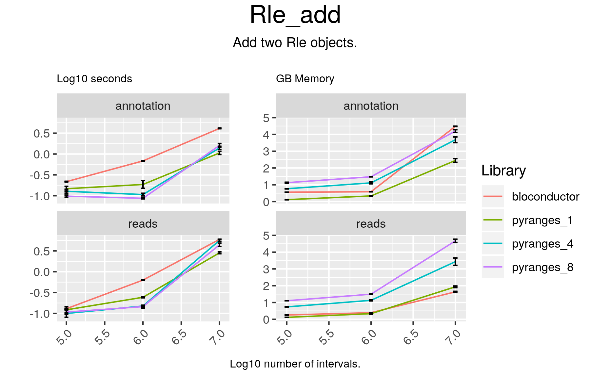

# Rle_add



## Code

#### bioconductor

```
result = c(c1p + c2p, c1m + c2m)

```

#### pyranges

```
result = c1 + c2
```

## Results

#### bioconductor

```
RleList of length 50
$chr1
integer-Rle of length 248928482 with 16103 runs
  Lengths:  65418     15  18696    101  86709 ...  12165   1586   8435    101
  Values :      0      1      0      1      0 ...      1      3      0      1

$chr10
integer-Rle of length 242095027 with 14034 runs
  Lengths:  42086    101  89299    101    738 ...   6391    101   3001    134
  Values :      0      1      0      1      0 ...      0      1      0      1

$chr11
integer-Rle of length 198185564 with 11507 runs
  Lengths:  23756    745 172269    293  94365 ...  11279    275  15289    216
  Values :      0      1      0      1      0 ...      0      1      0      1

$chr12
integer-Rle of length 190175845 with 9264 runs
  Lengths:  20439    101 100193    101  40077 ...  41140    101  32800   2072
  Values :      0      1      0      1      0 ...      0      1      0      2

$chr13
integer-Rle of length 181320878 with 10178 runs
  Lengths: 143046    210    123    124  11841 ...  53069     65   3250    233
  Values :      0      1      0      1      0 ...      0      1      0      1

...
<45 more elements>

```

#### pyranges

```
chr1 +
+--------+---------+------+---------+-------+---------+---------+---------+---------+--------+--------+-------+
| Runs   | 65419   | 14   | 18697   | 100   | 86710   |  ...    | 38646   | 12165   | 1585   | 8436   | 100   |
|--------+---------+------+---------+-------+---------+---------+---------+---------+--------+--------+-------|
| Values | 0.0     | 1.0  | 0.0     | 1.0   | 0.0     | ...     | 0.0     | 1.0     | 3.0    | 0.0    | 1.0   |
+--------+---------+------+---------+-------+---------+---------+---------+---------+--------+--------+-------+
Rle of length 248928482 containing 16202 elements
...
chrY -
+--------+---------+-------+---------+-------+---------+---------+-------+---------+-------+---------+-------+
| Runs   | 11704   | 100   | 46794   | 100   | 36552   |  ...    | 879   | 12621   | 100   | 26694   | 941   |
|--------+---------+-------+---------+-------+---------+---------+-------+---------+-------+---------+-------|
| Values | 0.0     | 1.0   | 0.0     | 1.0   | 0.0     | ...     | 1.0   | 0.0     | 1.0   | 0.0     | 1.0   |
+--------+---------+-------+---------+-------+---------+---------+-------+---------+-------+---------+-------+
Rle of length 57213125 containing 2044 elements
PyRles object with 50 chromosomes/strand pairs.
```

