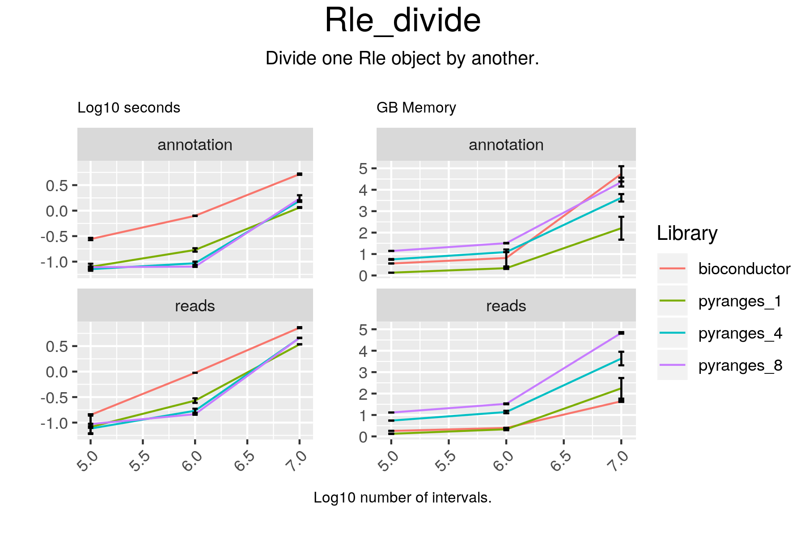

# Rle_divide

## Code

#### bioconductor

result = c(c1p / c2p, c1m / c2m)

#### pyranges

result = c1 / c2

## Results

#### bioconductor

RleList of length 50
$chr1
numeric-Rle of length 248928482 with 13826 runs
  Lengths:  65418     15  18696    101  86709 ...  38645  13751   8435    101
  Values :    NaN      0    NaN    Inf    NaN ...    NaN      0    NaN    Inf

$chr10
numeric-Rle of length 242095027 with 12389 runs
  Lengths:  42086    101  89299    101    738 ...   6391    101   3001    134
  Values :    NaN    Inf    NaN    Inf    NaN ...    NaN    Inf    NaN      0

$chr11
numeric-Rle of length 198185564 with 9927 runs
  Lengths:  23756    745 172269    293  94365 ...  11279    275  15289    216
  Values :    NaN      0    NaN      0    NaN ...    NaN      0    NaN      0

$chr12
numeric-Rle of length 190175845 with 8537 runs
  Lengths:  20439    101 100193    101  40077 ...  41140    101  32800   2072
  Values :    NaN    Inf    NaN    Inf    NaN ...    NaN    Inf    NaN      0

$chr13
numeric-Rle of length 181320878 with 9053 runs
  Lengths: 143046    210    123    124  11841 ...  53069     65   3250    233
  Values :    NaN      0    NaN      0    NaN ...    NaN      0    NaN      0

...
<45 more elements>

#### pyranges

chr1 +
+--------+---------+------+---------+-------+---------+---------+-------+---------+---------+--------+-------+
| Runs   | 65419   | 14   | 18697   | 100   | 86710   |  ...    | 100   | 38646   | 13750   | 8436   | 100   |
|--------+---------+------+---------+-------+---------+---------+-------+---------+---------+--------+-------|
| Values | nan     | 0.0  | nan     | inf   | nan     | ...     | inf   | nan     | 0.0     | nan    | inf   |
+--------+---------+------+---------+-------+---------+---------+-------+---------+---------+--------+-------+
Rle of length 248928482 containing 13872 elements
...
chrY -
+--------+---------+-------+---------+-------+---------+---------+-------+---------+-------+---------+-------+
| Runs   | 11704   | 100   | 46794   | 100   | 36552   |  ...    | 879   | 12621   | 100   | 26694   | 941   |
|--------+---------+-------+---------+-------+---------+---------+-------+---------+-------+---------+-------|
| Values | nan     | inf   | nan     | inf   | nan     | ...     | 0.0   | nan     | inf   | nan     | 0.0   |
+--------+---------+-------+---------+-------+---------+---------+-------+---------+-------+---------+-------+
Rle of length 57213125 containing 1986 elements
PyRles object with 50 chromosomes/strand pairs.

