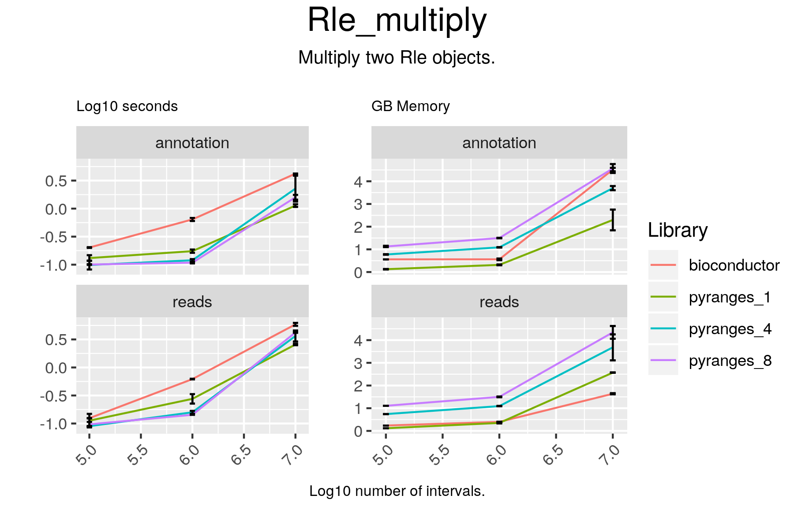

# Rle_multiply

## Code

#### bioconductor

result = c(c1p * c2p, c1m * c2m)

#### pyranges

result = c1 * c2

## Results

#### bioconductor

RleList of length 50
$chr1
integer-Rle of length 248928482 with 411 runs
  Lengths:  793416     101  168123     101 ...     101 2517555     101 1357876
  Values :       0       1       0       1 ...       1       0       1       0

$chr10
integer-Rle of length 242095027 with 360 runs
  Lengths: 1333807     101   91928     101 ...      39  111734     101  332081
  Values :       0       1       0       1 ...       1       0       2       0

$chr11
integer-Rle of length 198185564 with 406 runs
  Lengths: 4775894     101 2624998     101 ...     101   36356     101  158488
  Values :       0       1       0       1 ...       1       0       1       0

$chr12
integer-Rle of length 190175845 with 276 runs
  Lengths: 1336654     101  581425     101 ...     101 2494674     101 1406780
  Values :       0       1       0       1 ...       1       0       1       0

$chr13
integer-Rle of length 181320878 with 284 runs
  Lengths:   477780      101  4757244       61 ...  1930086      101   400773
  Values :        0        1        0        1 ...        0        1        0

...
<45 more elements>

#### pyranges

chr1 +
+--------+----------+-------+----------+-------+-----------+---------+----------+-------+-----------+-------+-----------+
| Runs   | 793417   | 100   | 168124   | 100   | 5039454   |  ...    | 504014   | 100   | 2517556   | 100   | 1357876   |
|--------+----------+-------+----------+-------+-----------+---------+----------+-------+-----------+-------+-----------|
| Values | 0.0      | 1.0   | 0.0      | 1.0   | 0.0       | ...     | 0.0      | 1.0   | 0.0       | 1.0   | 0.0       |
+--------+----------+-------+----------+-------+-----------+---------+----------+-------+-----------+-------+-----------+
Rle of length 248928482 containing 411 elements
...
chrY -
+--------+------------+-------+-----------+-------+-----------+---------+-------+-------+---------+-------+------------+
| Runs   | 13416074   | 100   | 5048364   | 100   | 7816751   |  ...    | 121   | 100   | 68465   | 100   | 30862850   |
|--------+------------+-------+-----------+-------+-----------+---------+-------+-------+---------+-------+------------|
| Values | 0.0        | 2.0   | 0.0       | 1.0   | 0.0       | ...     | 0.0   | 1.0   | 0.0     | 1.0   | 0.0        |
+--------+------------+-------+-----------+-------+-----------+---------+-------+-------+---------+-------+------------+
Rle of length 57213125 containing 11 elements
PyRles object with 50 chromosomes/strand pairs.

