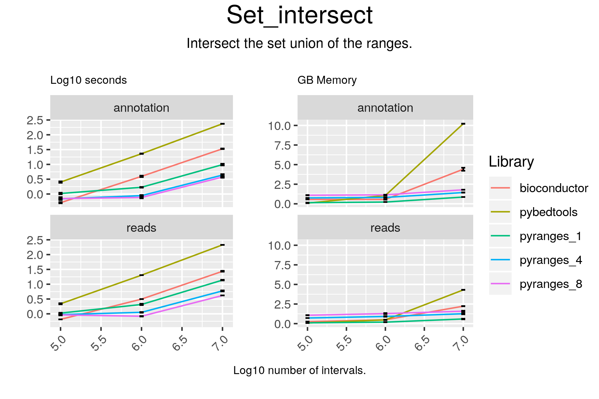

# Set_intersect



## Code

#### pyranges

```
result = gr2.set_intersect(gr, strandedness="same")

```

#### bioconductor

```
result = intersect(gr2, gr1)

```

#### pybedtools

```
# the first flag is needed to keep the sixth columns
sc = pb1.sort().merge(s=True, c=[4, 5, 6], o="first")

if extension == "gtf":
    cols_to_keep = [4, 5, 7]
elif extension == "bed":
    cols_to_keep = [4, 5, 6]

sb = pb2.sort().merge(s=True, c=cols_to_keep, o="first")
result = sc.intersect(sb, s=True)

```

## Results

#### pyranges

```
+--------------+-----------+-----------+----------+
| Chromosome   | Start     | End       | Strand   |
| (int8)       | (int32)   | (int32)   | (int8)   |
|--------------+-----------+-----------+----------|
| chr1         | 793417    | 793517    | +        |
| chr1         | 961641    | 961741    | +        |
| chr1         | 6001195   | 6001295   | +        |
| ...          | ...       | ...       | ...      |
| chrY         | 26281389  | 26281489  | -        |
| chrY         | 26281610  | 26281710  | -        |
| chrY         | 26350175  | 26350275  | -        |
+--------------+-----------+-----------+----------+
PyRanges object has 4915 sequences from 24 chromosomes.
```

#### bioconductor

```
GRanges object with 4916 ranges and 0 metadata columns:
         seqnames            ranges strand
            <Rle>         <IRanges>  <Rle>
     [1]     chr1     793417-793517      +
     [2]     chr1     961641-961741      +
     [3]     chr1   6001195-6001295      +
     [4]     chr1   7835989-7836089      +
     [5]     chr1   7840876-7840976      +
     ...      ...               ...    ...
  [4912]     chrY 13416074-13416174      -
  [4913]     chrY 18464538-18464638      -
  [4914]     chrY 26281389-26281489      -
  [4915]     chrY 26281610-26281710      -
  [4916]     chrY 26350175-26350275      -
  -------
  seqinfo: 25 sequences from an unspecified genome; no seqlengths

```

#### pybedtools

```
chr1	377483	377583	57003	100	-
chr1	407494	407594	84512	100	-
chr1	409556	409656	7163	100	-
chr1	473313	473413	35241	100	-
chr1	793417	793517	51492	100	+
chr1	920833	920933	81727	100	-
chr1	961641	961741	32070	100	+
chr1	1301689	1301789	20479	100	-
chr1	1703218	1703318	74975	100	-
chr1	1740047	1740147	97193	100	-
Number of lines: 4915

```

