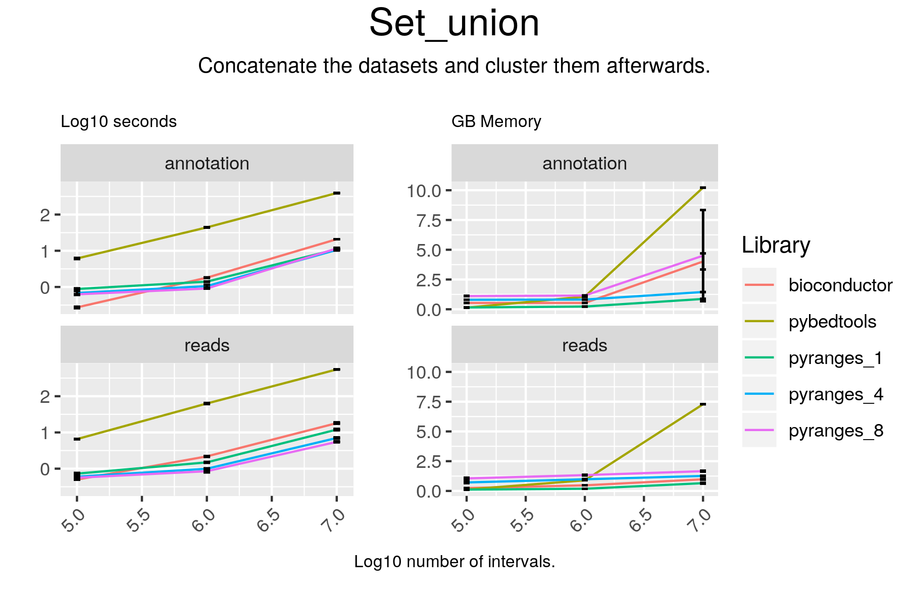

# Set_union

## Code

#### pyranges

result = gr2.set_union(gr, strandedness="same")

#### bioconductor

result = union(gr1, gr2)

#### pybedtools

# the first flag is needed to keep the sixth columns
sc = pb1.sort().merge(s=True, c=[4, 5, 6], o="first")

if extension == "gtf":
    cols_to_keep = [4, 5, 7]
elif extension == "bed":
    cols_to_keep = [4, 5, 6]

sb = pb2.sort().merge(s=True, c=cols_to_keep, o="first")
catted = sc.cat(sb, s=True, c=[4, 5, 6], o="first").sort()
result = catted.merge(s=True, c=[4, 5, 6], o="first")

## Results

#### pyranges

+--------------+-----------+-----------+----------+
| Chromosome   | Start     | End       | Strand   |
| (int8)       | (int32)   | (int32)   | (int8)   |
|--------------+-----------+-----------+----------|
| chr1         | 65418     | 65433     | +        |
| chr1         | 84130     | 84230     | +        |
| chr1         | 170940    | 171040    | +        |
| ...          | ...       | ...       | ...      |
| chrY         | 57171889  | 57172769  | -        |
| chrY         | 57185390  | 57185490  | -        |
| chrY         | 57212183  | 57213125  | -        |
+--------------+-----------+-----------+----------+
PyRanges object has 155261 sequences from 25 chromosomes.

#### bioconductor

GRanges object with 155253 ranges and 0 metadata columns:
           seqnames        ranges strand
              <Rle>     <IRanges>  <Rle>
       [1]     chr1   65419-65433      +
       [2]     chr1   84130-84230      +
       [3]     chr1 170940-171040      +
       [4]     chr1 194583-194683      +
       [5]     chr1 208271-208371      +
       ...      ...           ...    ...
  [155249]     chrM     4263-4331      +
  [155250]     chrM   10405-10469      +
  [155251]     chrM   15888-15953      +
  [155252]     chrM     4329-4400      -
  [155253]     chrM     7446-7514      -
  -------
  seqinfo: 25 sequences from an unspecified genome; no seqlengths

#### pybedtools

chr1	17368	17436	17369	17436	-
chr1	48326	48426	10243	100	-
chr1	52843	52943	73789	100	-
chr1	65418	65433	65419	65433	+
chr1	84130	84230	95640	100	+
chr1	89550	91105	89551	91105	-
chr1	99516	99616	60846	100	-
chr1	102557	102657	7534	100	-
chr1	139968	140068	32513	100	-
chr1	170940	171040	83728	100	+
Number of lines: 155261

