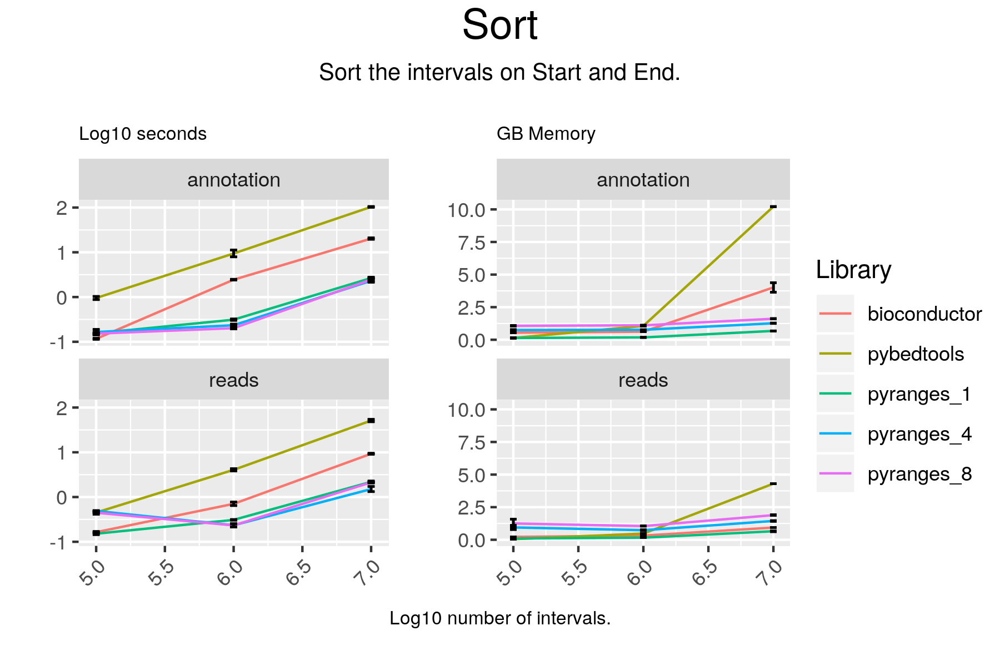

# Sort

## Code

#### pyranges

result = gr.sort()

#### bioconductor

result = sortSeqlevels(gr)
result = sort(result)

#### pybedtools

result = pb1.sort()

## Results

#### pyranges

+--------------+-----------+-----------+----------+
| Chromosome   | Start     | End       | Strand   |
| (int8)       | (int32)   | (int32)   | (int8)   |
|--------------+-----------+-----------+----------|
| chr1         | 65418     | 65433     | +        |
| chr1         | 587628    | 594768    | +        |
| chr1         | 631073    | 632616    | +        |
| ...          | ...       | ...       | ...      |
| chrY         | 26338834  | 26338994  | -        |
| chrY         | 57171889  | 57172769  | -        |
| chrY         | 57212183  | 57213125  | -        |
+--------------+-----------+-----------+----------+
PyRanges object has 100000 sequences from 25 chromosomes.

#### bioconductor

GRanges object with 100000 ranges and 20 metadata columns:
           seqnames        ranges strand |   source       type     score
              <Rle>     <IRanges>  <Rle> | <factor>   <factor> <numeric>
       [1]     chr1   65419-65433      + |   HAVANA       exon      <NA>
       [2]     chr1 587629-594768      + |   HAVANA       gene      <NA>
       [3]     chr1 631074-632616      + |   HAVANA       exon      <NA>
       [4]     chr1 778782-782191      + |   HAVANA transcript      <NA>
       [5]     chr1 784370-805127      + |   HAVANA transcript      <NA>
       ...      ...           ...    ... .      ...        ...       ...
   [99996]     chrM   10405-10469      + |  ENSEMBL       exon      <NA>
   [99997]     chrM   15888-15953      + |  ENSEMBL       gene      <NA>
   [99998]     chrM     4329-4400      - |  ENSEMBL transcript      <NA>
   [99999]     chrM     4329-4400      - |  ENSEMBL transcript      <NA>
  [100000]     chrM     7446-7514      - |  ENSEMBL       gene      <NA>
               phase           gene_id     transcript_id              gene_type
           <integer>       <character>       <character>            <character>
       [1]      <NA> ENSG00000186092.6 ENST00000641515.2         protein_coding
       [2]      <NA> ENSG00000235146.2              <NA>                lincRNA
       [3]      <NA> ENSG00000237973.1 ENST00000414273.1 unprocessed_pseudogene
       [4]      <NA> ENSG00000237491.8 ENST00000457084.1                lincRNA
       [5]      <NA> ENSG00000237491.8 ENST00000591440.5                lincRNA
       ...       ...               ...               ...                    ...
   [99996]      <NA> ENSG00000210174.1 ENST00000387439.1                Mt_tRNA
   [99997]      <NA> ENSG00000210195.2              <NA>                Mt_tRNA
   [99998]      <NA> ENSG00000210107.1 ENST00000387372.1                Mt_tRNA
   [99999]      <NA> ENSG00000210107.1 ENST00000387372.1                Mt_tRNA
  [100000]      <NA> ENSG00000210151.2              <NA>                Mt_tRNA
             gene_name        transcript_type transcript_name exon_number
           <character>            <character>     <character> <character>
       [1]       OR4F5         protein_coding       OR4F5-202           1
       [2]  AC114498.1                   <NA>            <NA>        <NA>
       [3]    MTCO1P12 unprocessed_pseudogene    MTCO1P12-201           1
       [4]  AL669831.5                lincRNA  AL669831.5-202        <NA>
       [5]  AL669831.5                lincRNA  AL669831.5-212        <NA>
       ...         ...                    ...             ...         ...
   [99996]       MT-TR                Mt_tRNA       MT-TR-201           1
   [99997]       MT-TT                   <NA>            <NA>        <NA>
   [99998]       MT-TQ                Mt_tRNA       MT-TQ-201        <NA>
   [99999]       MT-TQ                Mt_tRNA       MT-TQ-201        <NA>
  [100000]      MT-TS1                   <NA>            <NA>        <NA>
                     exon_id       level        protein_id
                 <character> <character>       <character>
       [1] ENSE00003812156.1           2 ENSP00000493376.2
       [2]              <NA>           2              <NA>
       [3] ENSE00001795950.1           2              <NA>
       [4]              <NA>           2              <NA>
       [5]              <NA>           2              <NA>
       ...               ...         ...               ...
   [99996] ENSE00001544482.1           3              <NA>
   [99997]              <NA>           3              <NA>
   [99998]              <NA>           3              <NA>
   [99999]              <NA>           3              <NA>
  [100000]              <NA>           3              <NA>
           transcript_support_level                    tag      ccdsid
                        <character>            <character> <character>
       [1]                     <NA>                  basic        <NA>
       [2]                     <NA>                   <NA>        <NA>
       [3]                       NA                  basic        <NA>
       [4]                        4                  basic        <NA>
       [5]                        5 RNA_Seq_supported_only        <NA>
       ...                      ...                    ...         ...
   [99996]                       NA                  basic        <NA>
   [99997]                     <NA>                   <NA>        <NA>
   [99998]                       NA                  basic        <NA>
   [99999]                       NA                  basic        <NA>
  [100000]                     <NA>                   <NA>        <NA>
                    havana_gene    havana_transcript         ont
                    <character>          <character> <character>
       [1] OTTHUMG00000001094.4 OTTHUMT00000003223.4        <NA>
       [2] OTTHUMG00000002329.1                 <NA>        <NA>
       [3] OTTHUMG00000002333.2 OTTHUMT00000006715.2 PGO:0000005
       [4] OTTHUMG00000002404.7 OTTHUMT00000006884.2        <NA>
       [5] OTTHUMG00000002404.7 OTTHUMT00000458574.1        <NA>
       ...                  ...                  ...         ...
   [99996]                 <NA>                 <NA>        <NA>
   [99997]                 <NA>                 <NA>        <NA>
   [99998]                 <NA>                 <NA>        <NA>
   [99999]                 <NA>                 <NA>        <NA>
  [100000]                 <NA>                 <NA>        <NA>
  -------
  seqinfo: 25 sequences from an unspecified genome; no seqlengths

#### pybedtools

chr1	ENSEMBL	gene	17369	17436	.	-	.	gene_id "ENSG00000278267.1"; gene_type "miRNA"; gene_name "MIR6859-1"; level 3;
chr1	HAVANA	exon	65419	65433	.	+	.	gene_id "ENSG00000186092.6"; transcript_id "ENST00000641515.2"; gene_type "protein_coding"; gene_name "OR4F5"; transcript_type "protein_coding"; transcript_name "OR4F5-202"; exon_number 1; exon_id "ENSE00003812156.1"; level 2; protein_id "ENSP00000493376.2"; tag "RNA_Seq_supported_partial"; tag "basic"; havana_gene "OTTHUMG00000001094.4"; havana_transcript "OTTHUMT00000003223.4";
chr1	HAVANA	transcript	89551	91105	.	-	.	gene_id "ENSG00000239945.1"; transcript_id "ENST00000495576.1"; gene_type "lincRNA"; gene_name "AL627309.3"; transcript_type "lincRNA"; transcript_name "AL627309.3-201"; level 2; transcript_support_level "5"; tag "basic"; havana_gene "OTTHUMG00000001097.2"; havana_transcript "OTTHUMT00000003226.2";
chr1	HAVANA	exon	188791	188902	.	-	.	gene_id "ENSG00000279457.4"; transcript_id "ENST00000623083.4"; gene_type "unprocessed_pseudogene"; gene_name "FO538757.1"; transcript_type "unprocessed_pseudogene"; transcript_name "FO538757.1-201"; exon_number 2; exon_id "ENSE00003755850.1"; level 2; transcript_support_level "NA"; ont "PGO:0000005"; tag "basic"; havana_gene "OTTHUMG00000191963.1"; havana_transcript "OTTHUMT00000491421.1";
chr1	HAVANA	exon	297345	297502	.	-	.	gene_id "ENSG00000228463.10"; transcript_id "ENST00000424587.7"; gene_type "transcribed_processed_pseudogene"; gene_name "AP006222.1"; transcript_type "processed_transcript"; transcript_name "AP006222.1-206"; exon_number 1; exon_id "ENSE00001697423.1"; level 2; transcript_support_level "5"; havana_gene "OTTHUMG00000002552.3"; havana_transcript "OTTHUMT00000007242.3";
chr1	HAVANA	transcript	373182	485208	.	-	.	gene_id "ENSG00000237094.12"; transcript_id "ENST00000455207.5"; gene_type "transcribed_unprocessed_pseudogene"; gene_name "AL732372.2"; transcript_type "processed_transcript"; transcript_name "AL732372.2-204"; level 2; transcript_support_level "5"; tag "not_best_in_genome_evidence"; havana_gene "OTTHUMG00000002857.7"; havana_transcript "OTTHUMT00000007991.1";
chr1	HAVANA	CDS	450743	451678	.	-	0	gene_id "ENSG00000284733.1"; transcript_id "ENST00000426406.3"; gene_type "protein_coding"; gene_name "OR4F29"; transcript_type "protein_coding"; transcript_name "OR4F29-201"; exon_number 1; exon_id "ENSE00002316283.3"; level 2; protein_id "ENSP00000409316.1"; transcript_support_level "NA"; tag "basic"; tag "appris_principal_1"; tag "CCDS"; ccdsid "CCDS72675.1"; havana_gene "OTTHUMG00000002860.3"; havana_transcript "OTTHUMT00000007999.3";
chr1	HAVANA	transcript	494475	495368	.	-	.	gene_id "ENSG00000237094.12"; transcript_id "ENST00000642074.1"; gene_type "transcribed_unprocessed_pseudogene"; gene_name "AL732372.2"; transcript_type "processed_transcript"; transcript_name "AL732372.2-211"; level 2; havana_gene "OTTHUMG00000002857.7"; havana_transcript "OTTHUMT00000493597.1";
chr1	HAVANA	transcript	498281	499175	.	-	.	gene_id "ENSG00000237094.12"; transcript_id "ENST00000432964.1"; gene_type "transcribed_unprocessed_pseudogene"; gene_name "AL732372.2"; transcript_type "processed_transcript"; transcript_name "AL732372.2-220"; level 2; transcript_support_level "3"; havana_gene "OTTHUMG00000002857.7"; havana_transcript "OTTHUMT00000346878.1";
chr1	HAVANA	exon	504980	505103	.	-	.	gene_id "ENSG00000237094.12"; transcript_id "ENST00000641303.1"; gene_type "transcribed_unprocessed_pseudogene"; gene_name "AL732372.2"; transcript_type "processed_transcript"; transcript_name "AL732372.2-222"; exon_number 3; exon_id "ENSE00003812904.1"; level 2; havana_gene "OTTHUMG00000002857.7"; havana_transcript "OTTHUMT00000493601.1";
Number of lines: 100000

