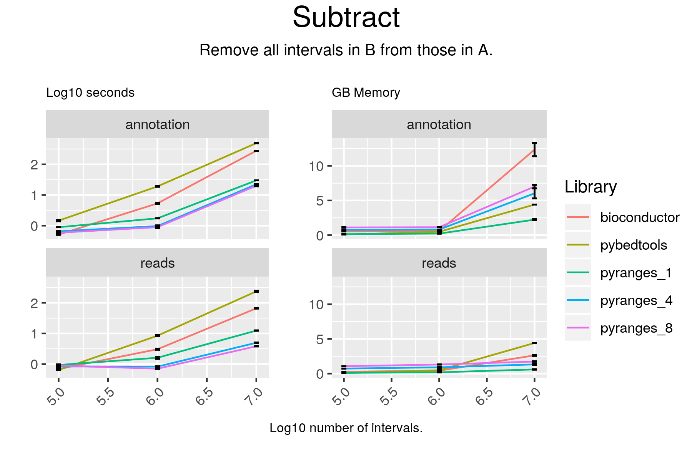

# Subtract



## Code

#### pyranges

```
result = gr2.subtract(gr, strandedness="same")

```

#### bioconductor

```
hits <- findOverlaps(gr2, gr1, ignore.strand = FALSE)
toSubtract <- reduce(extractList(gr1, as(hits, "List")),
    ignore.strand = FALSE)
ans <- unlist(psetdiff(gr2, toSubtract, ignore.strand = FALSE))
result <- subset(ans, width(ans) > 0L)

```

#### pybedtools

```
result = pb2.subtract(pb1, s=True)
```

## Results

#### pyranges

```
+--------------+-----------+-----------+----------+------------+-------------+----------------+--------------+-------------+
| Chromosome   | Start     | End       | Strand   | Feature    | GeneID      | TranscriptID   | ExonNumber   | ExonID      |
| (int8)       | (int32)   | (int32)   | (int8)   | (object)   | (float64)   | (float64)      | (int16)      | (float64)   |
|--------------+-----------+-----------+----------+------------+-------------+----------------+--------------+-------------|
| chr1         | 39479797  | 39480009  | +        | CDS        | 127603.0    | 361689.0       | 91           | 3546381.0   |
| chr1         | 84173328  | 84173352  | +        | CDS        | 142875.0    | 436133.0       | 2            | 1414414.0   |
| chr1         | 179293713 | 179293936 | +        | UTR        | 57252.0     | 540564.0       | 1            | 2262754.0   |
| ...          | ...       | ...       | ...      | ...        | ...         | ...            | ...          | ...         |
| chrY         | 26086086  | 26086199  | -        | exon       | 234888.0    | 411536.0       | 3            | 1614971.0   |
| chrY         | 23190573  | 23190637  | -        | exon       | 188120.0    | 540248.0       | 5            | 1677573.0   |
| chrY         | 7701186   | 7701247   | -        | exon       | 225520.0    | 437686.0       | 1            | 1723990.0   |
+--------------+-----------+-----------+----------+------------+-------------+----------------+--------------+-------------+
PyRanges object has 105649 sequences from 25 chromosomes.
```

#### bioconductor

```
GRanges object with 105649 ranges and 0 metadata columns:
           seqnames              ranges strand
              <Rle>           <IRanges>  <Rle>
       [1]     chr2 110641034-110641205      -
       [2]    chr17     8319007-8319159      +
       [3]    chr22   43995391-43995490      +
       [4]     chr1 160299102-160299264      -
       [5]    chr17   10679050-10681253      -
       ...      ...                 ...    ...
  [105645]     chr3 186570163-186570897      +
  [105646]    chr12   41572364-41573887      +
  [105647]     chr1   11972872-11972997      +
  [105648]    chr10   18256579-18257320      -
  [105649]    chr14   39147812-39170322      -
  -------
  seqinfo: 25 sequences from an unspecified genome; no seqlengths

```

#### pybedtools

```
chr2	ENSEMBL	CDS	110641034	110641205	.	-	1	gene_id "ENSG00000169679.14"; transcript_id "ENST00000535254.5"; gene_type "protein_coding"; gene_name "BUB1"; transcript_type "protein_coding"; transcript_name "BUB1-212"; exon_number 22; exon_id "ENSE00001146562.1"; level 3; protein_id "ENSP00000441013.1"; transcript_support_level "2"; tag "basic"; tag "appris_alternative_2"; tag "CCDS"; ccdsid "CCDS62984.1"; havana_gene "OTTHUMG00000153638.5";
chr17	HAVANA	exon	8319007	8319159	.	+	.	gene_id "ENSG00000198844.11"; transcript_id "ENST00000361926.7"; gene_type "protein_coding"; gene_name "ARHGEF15"; transcript_type "protein_coding"; transcript_name "ARHGEF15-201"; exon_number 13; exon_id "ENSE00000855086.1"; level 2; protein_id "ENSP00000355026.3"; transcript_support_level "1"; tag "basic"; tag "appris_principal_1"; tag "CCDS"; ccdsid "CCDS11139.1"; havana_gene "OTTHUMG00000108187.6"; havana_transcript "OTTHUMT00000226993.3";
chr22	HAVANA	exon	43995391	43995490	.	+	.	gene_id "ENSG00000100347.14"; transcript_id "ENST00000493621.1"; gene_type "protein_coding"; gene_name "SAMM50"; transcript_type "processed_transcript"; transcript_name "SAMM50-205"; exon_number 1; exon_id "ENSE00001829394.1"; level 2; transcript_support_level "2"; havana_gene "OTTHUMG00000150557.4"; havana_transcript "OTTHUMT00000318983.1";
chr1	HAVANA	exon	160299102	160299264	.	-	.	gene_id "ENSG00000122218.15"; transcript_id "ENST00000648501.1"; gene_type "protein_coding"; gene_name "COPA"; transcript_type "nonsense_mediated_decay"; transcript_name "COPA-213"; exon_number 12; exon_id "ENSE00003836016.1"; level 2; protein_id "ENSP00000498118.1"; tag "mRNA_start_NF"; tag "cds_start_NF"; tag "RNA_Seq_supported_only"; havana_gene "OTTHUMG00000033111.8"; havana_transcript "OTTHUMT00000498717.1";
chr17	HAVANA	exon	10679050	10681253	.	-	.	gene_id "ENSG00000133028.11"; transcript_id "ENST00000577335.2"; gene_type "protein_coding"; gene_name "SCO1"; transcript_type "nonsense_mediated_decay"; transcript_name "SCO1-202"; exon_number 7; exon_id "ENSE00003831584.1"; level 2; protein_id "ENSP00000464032.1"; transcript_support_level "3"; tag "NAGNAG_splice_site"; havana_gene "OTTHUMG00000130364.8"; havana_transcript "OTTHUMT00000440329.2";
chr11	ENSEMBL	CDS	123622506	123622592	.	+	0	gene_id "ENSG00000023171.17"; transcript_id "ENST00000322282.11"; gene_type "protein_coding"; gene_name "GRAMD1B"; transcript_type "protein_coding"; transcript_name "GRAMD1B-201"; exon_number 20; exon_id "ENSE00001465572.4"; level 3; protein_id "ENSP00000325628.7"; transcript_support_level "5"; tag "basic"; havana_gene "OTTHUMG00000166004.6";
chr7	HAVANA	UTR	711506	711527	.	-	.	gene_id "ENSG00000188191.14"; transcript_id "ENST00000360274.8"; gene_type "protein_coding"; gene_name "PRKAR1B"; transcript_type "protein_coding"; transcript_name "PRKAR1B-201"; exon_number 2; exon_id "ENSE00003653279.1"; level 2; protein_id "ENSP00000353415.4"; transcript_support_level "1"; tag "basic"; tag "appris_principal_1"; tag "CCDS"; ccdsid "CCDS34579.1"; havana_gene "OTTHUMG00000151411.5"; havana_transcript "OTTHUMT00000322523.1";
chr7	HAVANA	exon	100156386	100156549	.	-	.	gene_id "ENSG00000146826.16"; transcript_id "ENST00000456769.5"; gene_type "protein_coding"; gene_name "C7orf43"; transcript_type "protein_coding"; transcript_name "C7orf43-206"; exon_number 8; exon_id "ENSE00000977581.2"; level 2; protein_id "ENSP00000389672.2"; transcript_support_level "2"; tag "basic"; tag "CCDS"; ccdsid "CCDS78261.1"; havana_gene "OTTHUMG00000154862.6"; havana_transcript "OTTHUMT00000337425.4";
chr3	HAVANA	exon	108213931	108214021	.	-	.	gene_id "ENSG00000114446.4"; transcript_id "ENST00000478157.1"; gene_type "protein_coding"; gene_name "IFT57"; transcript_type "nonsense_mediated_decay"; transcript_name "IFT57-204"; exon_number 3; exon_id "ENSE00003532129.1"; level 2; protein_id "ENSP00000417768.1"; transcript_support_level "5"; havana_gene "OTTHUMG00000159223.2"; havana_transcript "OTTHUMT00000353919.1";
chr17	HAVANA	exon	47051296	47051400	.	+	.	gene_id "ENSG00000263142.5"; transcript_id "ENST00000570311.1"; gene_type "transcribed_unprocessed_pseudogene"; gene_name "LRRC37A17P"; transcript_type "transcribed_unprocessed_pseudogene"; transcript_name "LRRC37A17P-201"; exon_number 8; exon_id "ENSE00002636545.1"; level 2; transcript_support_level "NA"; ont "PGO:0000005"; ont "PGO:0000019"; tag "basic"; havana_gene "OTTHUMG00000178082.1"; havana_transcript "OTTHUMT00000440449.1";
Number of lines: 105649

```

