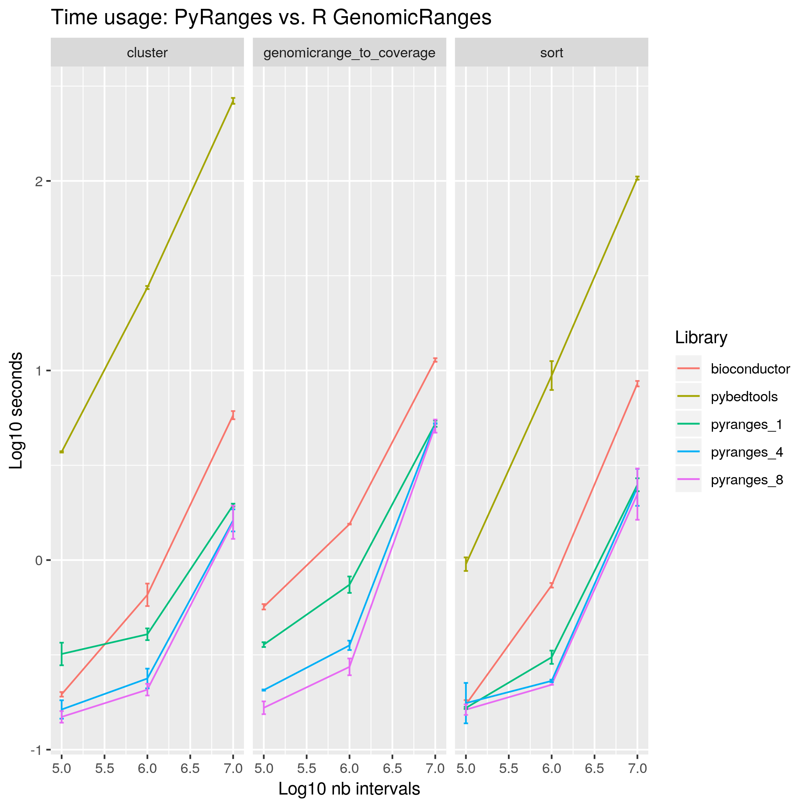
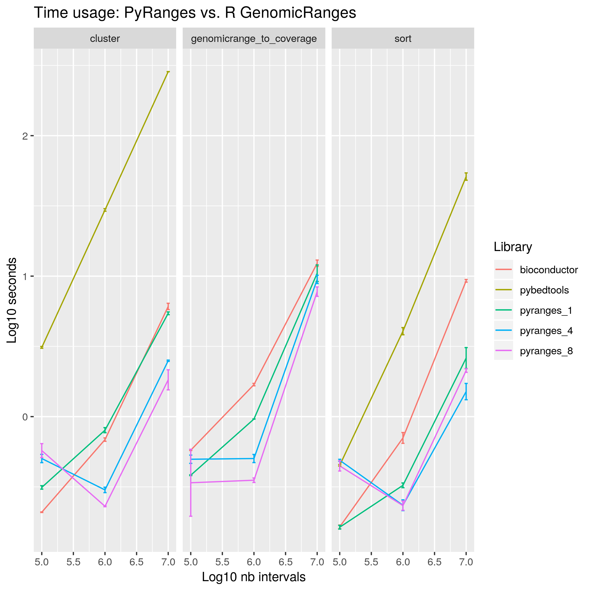
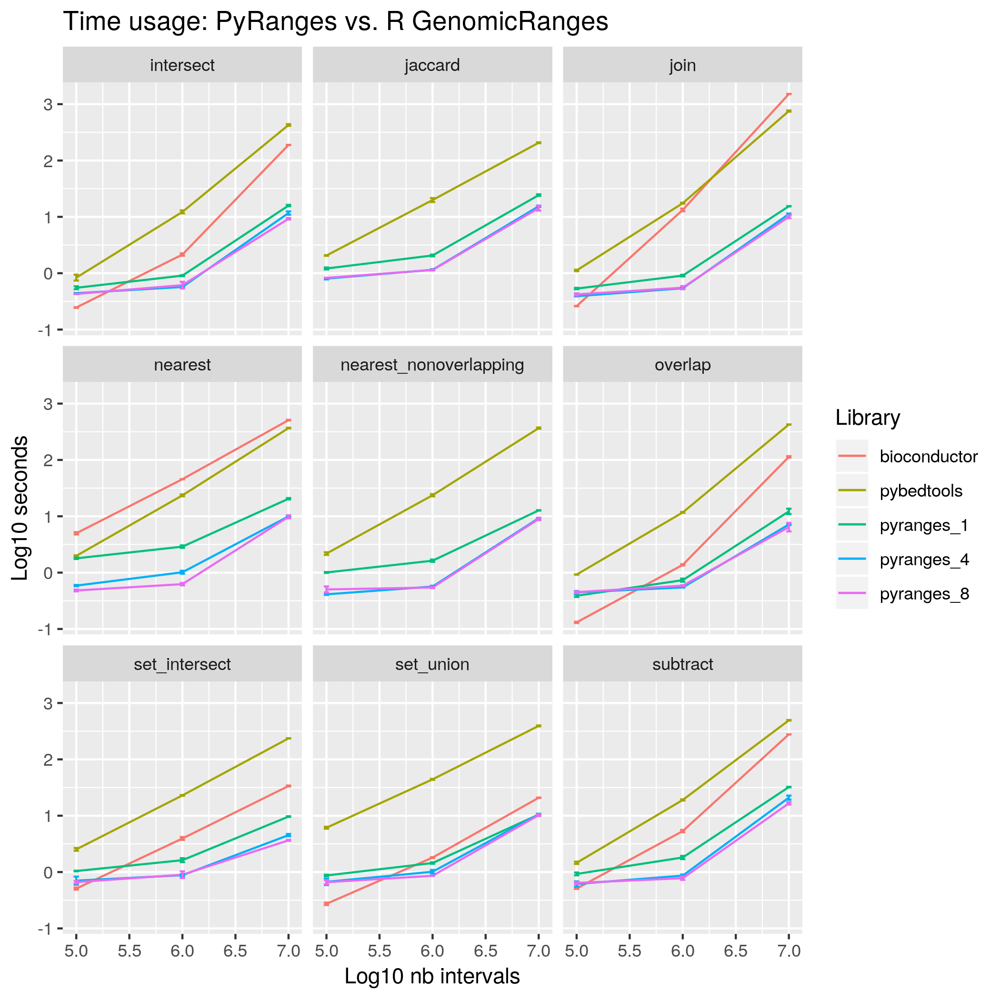
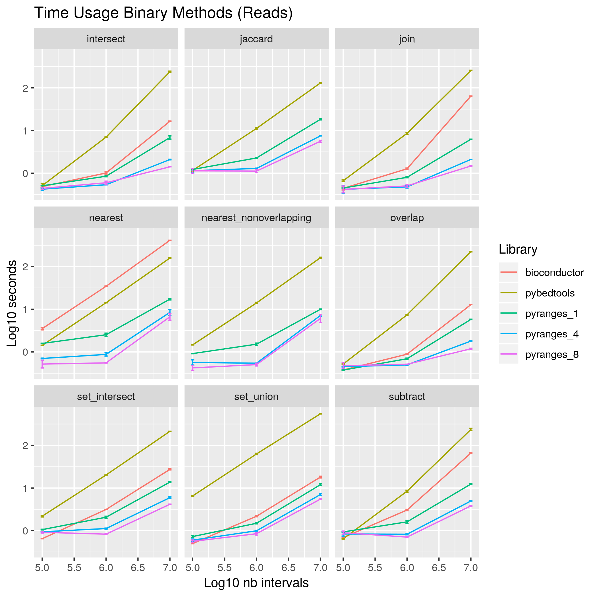
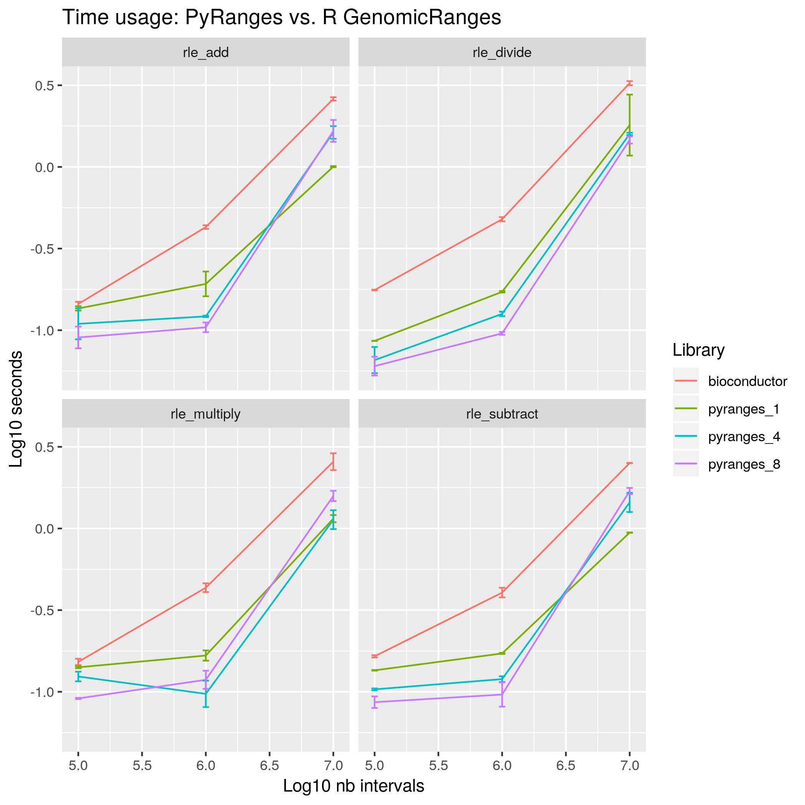
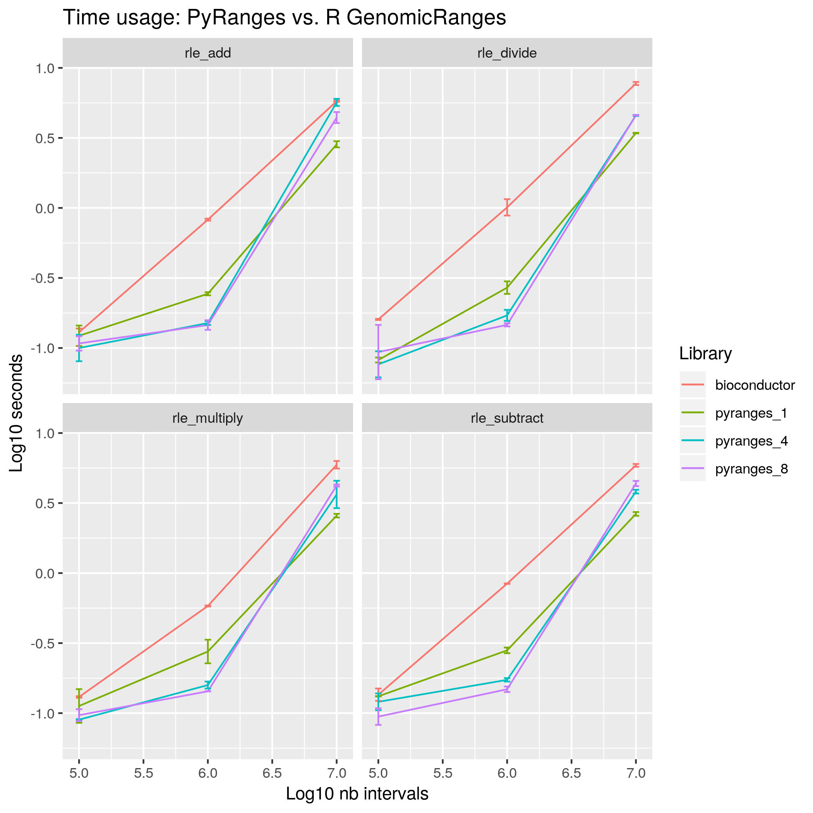
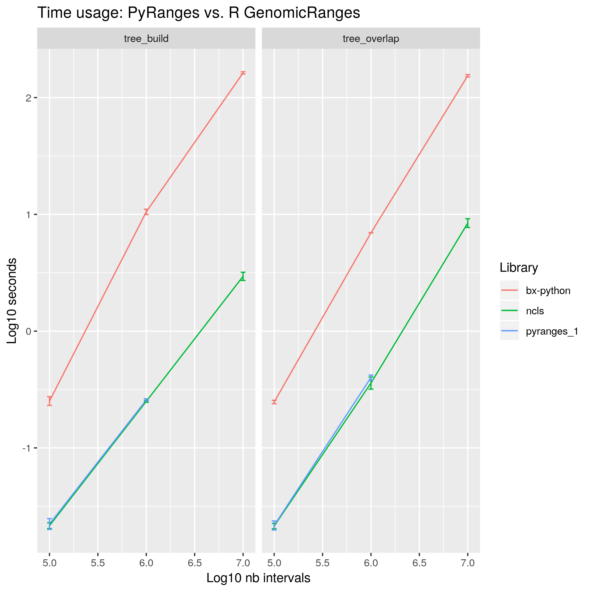
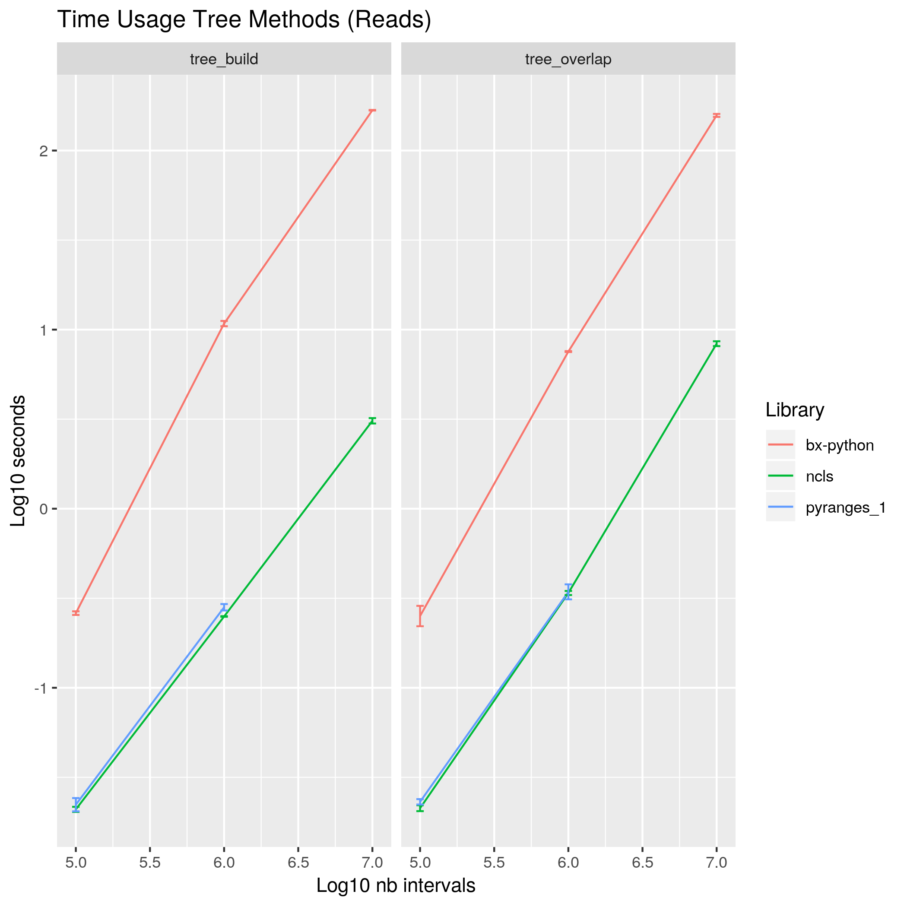
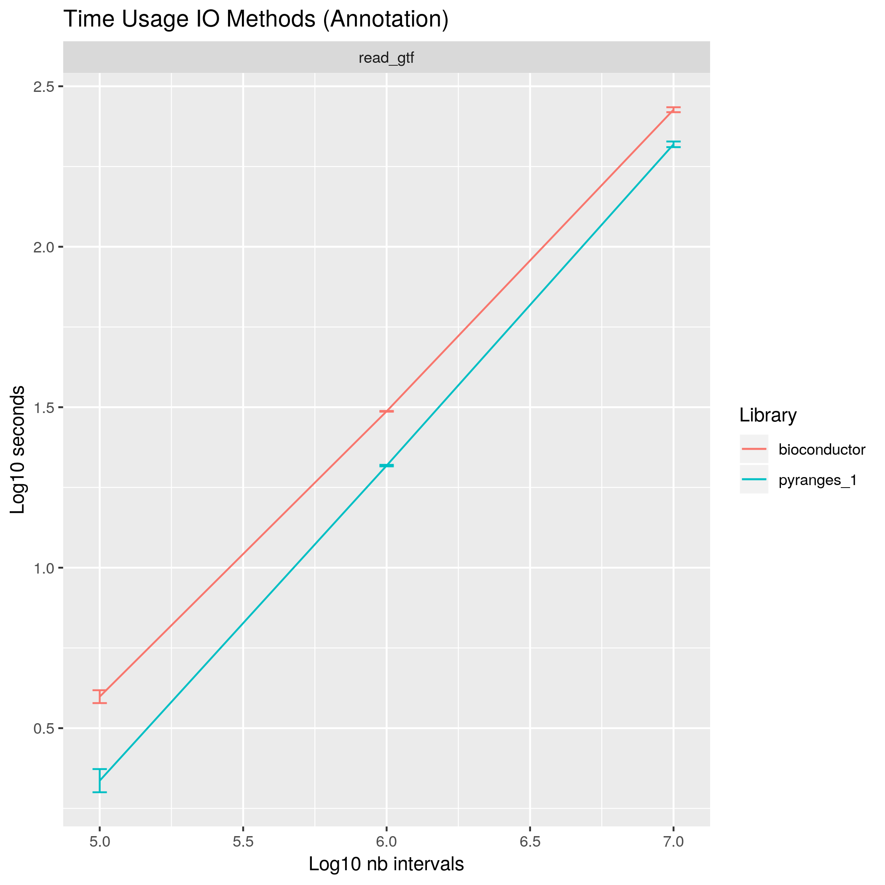
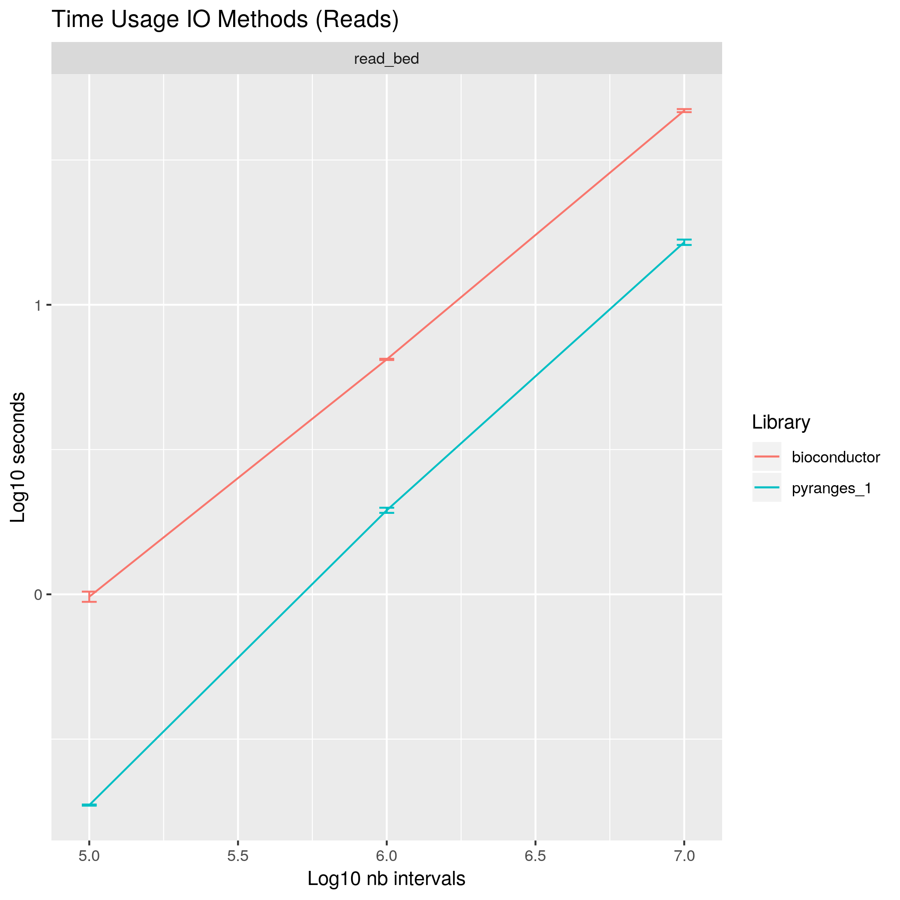

# Timing: PyRanges vs. R GenomicRanges vs. bedtools
### unary
#### annotation

#### reads

### binary
#### annotation

#### reads

### rle
#### annotation

#### reads

### tree
#### annotation

#### reads

### io
#### annotation

#### reads

