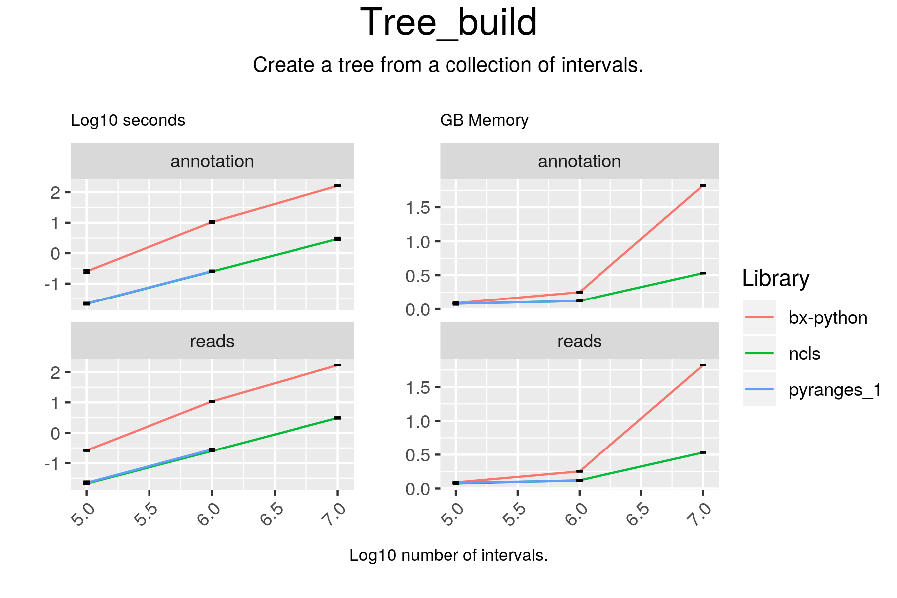

# Tree_build



## Code

#### ncls

```
tree = NCLS(df2.Start.values, df2.End.values, df2.index.values)

```

#### bx-python

```
tree = IntervalTree()
for start_, end_ in zip(df2.Start, df2.End):
    tree.add(start_, end_)

```

## Results

#### ncls

```
NCLS32
------
Number intervals:
100000
Number of intervals in main list:
100000
Number of intervals with subintervals:
0
Percentage in top-level interval
1.0
```

#### bx-python

```
<quicksect.IntervalTree object at 0x7ff27ca14438>
```

