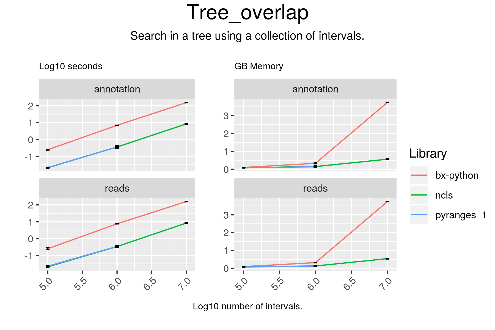

# Tree_overlap



## Code

#### ncls

```
result = tree.all_overlaps_self(df1.Start.values, df1.End.values, df1.index.values)
result = df2.iloc[result]

```

#### bx-python

```
result = []
for start_, end_ in zip(df1.Start, df1.End):
    result.append(tree.search(start_, end_))

```

## Results

#### ncls

```
	Start	End
0	133497735	133497835
1	69494035	69494135
2	156678709	156678809
3	67965860	67965960
4	41403840	41403940

```

#### bx-python

```
[[[Interval(133497735, 133497835)], [Interval(69494035, 69494135)], [Interval(156678709, 156678809)], [Interval(67965860, 67965960)], [Interval(41403840, 41403940)]]]
```

